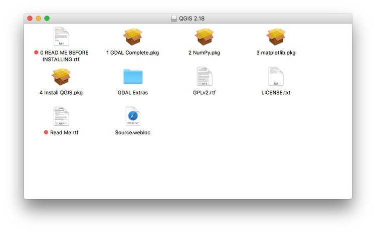

# Software and other tools

When you try to install some of the software below, your Mac may refuse to do so, warning you that it comes from an unidentified developer. If this happens, right-click the installer file and select `Open`.

### [Chrome](https://www.mozilla.org/en-US/firefox/new/)

Some of the tools we will use are Chrome add-ons. Ensure that you have the latest version of this popular web browser. Download Chrome [from here](https://www.mozilla.org/en-US/firefox/all/); if already installed, make sure you are updated to the latest version [following these instructions](https://support.google.com/chrome/answer/95414?co=GENIE.Platform%3DDesktop&hl=en).

### [Google Sheets](https://www.google.com/sheets/about/)
Our spreadsheet application for these classes will be Google Sheets. Use from your [Google Drive ]()account.

### [Open Refine](http://openrefine.org/)
A powerful tool for data processing and cleaning. Download the latest **stable version** [from here](http://openrefine.org/download.html). When launched, Open Refine will work in your default web browser; note that your data remains on your computer, and is not uploaded to the web.

### [R](http://www.r-project.org/) and [R Studio](http://www.rstudio.com/)
R is a software environment and programming language for statistical computing, data analysis, and graphics. Think of it as a Swiss Army knife for working with data. Download the latest `.pkg` installer for OSX from [here](https://cran.rstudio.com/). R Studio provides a user interface that makes it much easier to use. Download the latest **free** version of RStudio Desktop [from here](http://www.rstudio.com/products/rstudio/download/).

### [Postgres.app](https://postgresapp.com/)

Download from [here](https://postgresapp.com/) and follow the installation instructions. For step `3`, you will need to open a Terminal window (under Utilities in your Applications folder), copy and paste the two lines of code, and hit return. You will then have to enter your computer password.

This software allows you to work with [PostgreSQL](https://www.postgresql.org/) databases, including running spatial queries on geographic data using the [PostGIS](http://postgis.net/) extension.

### [Postico](https://eggerapps.at/postico/)

Postico is a user interface that makes it much (much) easier to work with PostgreSQL databases. Download from [here](https://eggerapps.at/postico/).

### [QGIS](http://qgis.org/en/site/)
The leading open source Geographic Information System, which we will use to make maps and analyze geographic data. Download the latest **standard** version of QGIS and its requirements [from here](http://www.kyngchaos.com/software/qgis/).

Double-click on the downloaded `.dmg` file, which will open this window

Now install the `.pkg` files in numbered order:
- GDAL
- NumPy
- matplotlib
- QGIS
