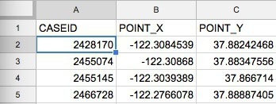
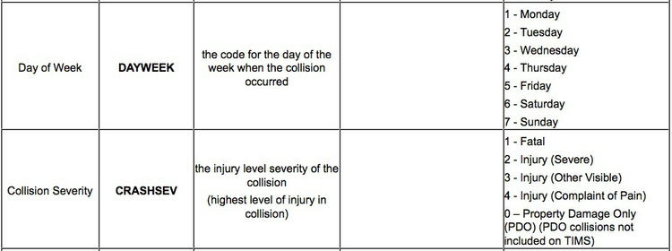
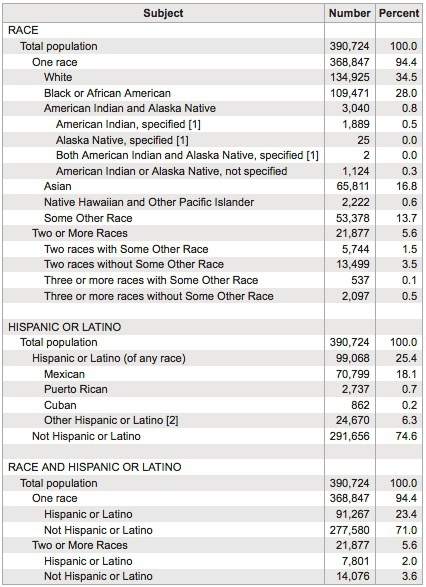
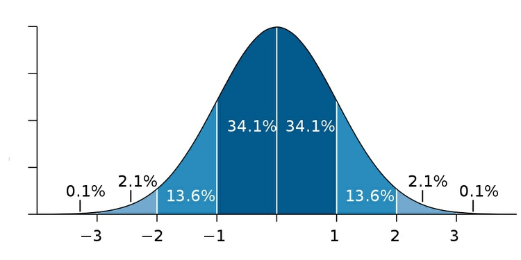
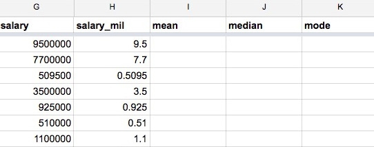
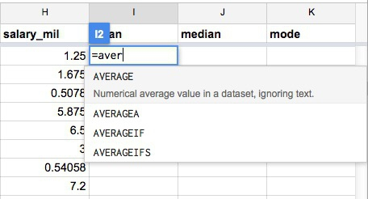
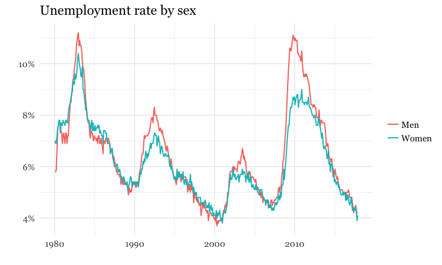
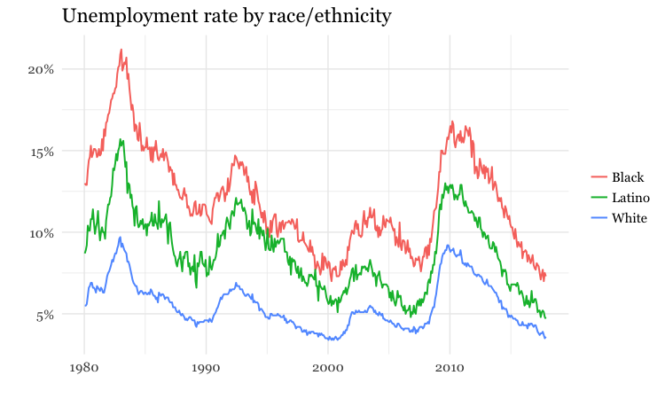

# What is data?

### What can data journalism do for me?

You almost certainly didn't come to J-school to do math. So why should you want to learn about data journalism?

Presumably you did come here for some of these reasons:

- To find and tell great stories.

- To help people understand the complex and often confusing world in which we live.

- To hold those in positions of power to account.

- To expose injustice.

Over the coming semester, we hope to equip you with  some basic skills with data that will help you achieve those goals.

Data can provide valuable context for any story. Importantly, it can be where you find the idea for a story in the first place. It can also expose when fallible or manipulative human sources are giving you false information: If you don't want to be bamboozled by statistics, you need to be able to make sense of the data for yourself.

But data journalism isn't a skill to be practised in isolation. We want you to think of data as just another source of information: like public records, and like the people you interview. Indeed, we're going to encourage you to think in terms of "interviewing" data, and show you how to ask questions of a dataset.

### The data frame of mind

Some good news: This is *not* rocket science!

Working with data needn't be mysterious or daunting. If you think clearly, get to know the data you're working with, and apply the  skills we'll cover in the coming weeks, you'll be able to use data to become a better journalist.

Data journalism is another tool in the modern journalist's toolbox. To put that another way, it's the *journalism* part of data journalism that really matters.

So we're going to encourage you to develop a data frame of mind. Rather then being an afterthought, researched when an editor asks if you've got some numbers or a chart to go with that story, we want you to put it front-and-center when you start your reporting: As well as thinking about who you need to speak to, think about what sources of data are available, and how you can ask questions of that data that will inform the rest of your reporting.

### Don't drown your audience in a sea of statistics

A common mistake made by reporters starting to work with data is to throw lots of numbers into their stories. This is rarely enlightening and usually off-putting. The goal of working with data is for you to find new stories, or gain a deeper understanding of what your're covering. When you tell those stories, use only the numbers that are necessary to get the point across.

### The data we will use today

Download the data for this session from [here](data/week1.zip), unzip the folder and place it on your desktop. It contains the following files:

- `berkeley_collisions.csv` Data on injury and fatal traffic accidents in Berkeley from 2006 to 2014, from the [Transportation Injury Mapping System](http://tims.berkeley.edu/). The data comes from the California Highway Patrol’s [Statewide Integrated Traffic Records System](http://iswitrs.chp.ca.gov/Reports/jsp/userLogin.jsp) and was then geocoded for mapping by UC Berkeley’s Safe Transportation Research & Education Center.

- `mlb_salaries_2015.csv` Salaries of players in Major League Baseball at the start of the 2015 season, from the [Lahman Baseball Database](http://www.seanlahman.com/baseball-archive/statistics/).

These files are in CSV format, which stands for comma-separated values; they have a `.csv` extension. These are plain text files, in which columns in the data are separated by commas. CSV is a common format for storing and exchanging data. Values that are intended to be treated as text, rather than numbers, are often enclosed in quote marks.

Here is what the `berkeley_collisions.csv` file looks like when you open it in a text editor.


When you ask for data, requesting it as CSVs or other plain text files is a good idea, as just about all software that handles data can export and import data as text. (If a government agency tells you that they cannot export data from their systems as text files, they are almost certainly mistaken, or lying!) You will also find that many online databases provide data for download in this format.

The characters used to separate the columns in a text file, called "delimiters," may vary. A `.tsv` extension, for instance, indicates that the variables are separated by tabs. More generally, text files may have the extension `.txt`.

### Get to know your data

Before attempting to analyze a dataset, it’s important to know what, exactly, you’re working with. So the first thing you usually want to do with any data is open it up in a spreadsheet, and make sure you understand how it is structured.

Go to your [**Google Drive**](https://drive.google.com/drive/my-drive) account. Now select `NEW>Google Sheets`. In the spreadsheet, select `File>Import...` from the top menu, and at the next dialog box, select the  `Upload` tab:


Navigate to the file `berkeley_collisions.csv` and complete the import.

In Google Sheets, the file should look like this:


The top row should be treated as a header row. So drag the gray divider at the base of the empty cell at top left, between column `A` and row `1`, like this:

**Before:**



**After:**


Select the header row by clicking the number `1` at the left, and then type `⌘-B` to make the headers bold. Notice how the header row now remains in place at the top of the screen as you scroll up and down through the data.


### Types of data: categorical vs. continuous

Tables of data consist of a series of "variables," which are simply measurements or attributes of all of the "records" in the dataset. For example, school students might gather data about themselves for a class project, noting their gender and eye color, and height and weight. Here, each student is a record in the data, for which there will be a value for gender, eye color, height, and weight.

But there’s an important difference between gender and eye color, called "categorical" variables, and height and weight, termed "continuous."

- **Categorical** variables are descriptive labels given to individual records, assigning them to different groups. The simplest categorical data is dichotomous, meaning that there are just two possible groups -- in an election, for instance, people either voted, or they did not. More commonly, there are multiple categories. When analyzing traffic accidents, for example, you might consider the weather conditions when the accident happened, in categories such as "clear," "cloudy," "raining," "fog," and so on.

- **Continuous** data is richer, consisting of numbers that can have a range of values on a sliding scale. The number of people killed or injured in a traffic accident would be one example.

There's a third type of data we often need to consider: **date and time**. A simple timeline treats date/time as a continuous variable, but date/time data can also be made categorical (days of the week, months of the year, and so on).

### Know the variables in your data, and how they are coded

Datasets will usually contain a mixture of categorical, continuous, and date/time variables.

The Berkeley traffic accidents data is in a typical layout, with each row in the data representing an individual collision, each of which has a unique code, its `CASEID`. Having a unique ID for each record in a dataset is good practice.

Here, each of the columns in the data is a separate variable.

Don’t assume, however, that every number in a dataset represents a continuous variable. Text descriptions can make datasets unwieldy, so database managers often adopt simpler codes, which are often be numbers, to store categorical data.

Looking at the first few columns, `YEAR_` is fairly obviously a date-related variable, while the longitudes and latitudes (`POINT_Y` and `POINT_X`) for each collision, and the numbers of people `KILLED` or `INJURED`, are continuous variables.

But the other columns in this view, including `DAYWEEK` and `CRASHSEV` are actually categorical variables, coded as numbers.

Like this example, many datasets are hard to understand without their supporting documentation. So each time you acquire a dataset, make sure you also obtain any documents/descriptions that are necessary to interpret it. These might be called the "codebook," "data dictionary," or "record layout." Whatever they are called, you will need to understand all of the variables in the data, and how they are coded.

[Here is the codebook](TIMS.html) for the Berkeley traffic accident data. Notice, for example, how the day of the week and the severity of the collision are coded:




### Is your data wide or long?

Often, especially if you are working with data over time, the data you obtain may not be in the format above, with one variable in each column.

Here, for example, is some data downloaded from the [World Bank's data site](http://data.worldbank.org/indicator/?tab=all) on the [value of high-technology exports](http://data.worldbank.org/indicator/TX.VAL.TECH.CD?view=chart) for different countries and groups of countries over time, expressed in current U.S. dollars. There are four variables in this data, which I've color-coded to make them easier to spot:


The variables are:
- `Country Name` Yellow
- `Country Code` Green
- `Year` Blue
- `High-Tech Exports` Pink

While this "wide" data format makes the spreadsheet easier for people to scan, most software for data analysis and visualization wants the data in a neat "long" format, with one variable in each column, like this:


So you may need to convert data from wide to long format. We will learn how to do this in Week 4.


### How do I interview data? The basic operations

There are many sophisticted statistical methods for crunching data, beyond the scope of these classes. But the majority of a data journalist's work involves the following simple operations:

- **Sort:** Largest to smallest, oldest to newest, alphabetical etc.

- **Filter:** Select a defined subset of the data.

- **Summarize/Aggregate:** Deriving one value from a series of other values to produce a summary statistic. Examples include: count, sum, mean, median, maximum, minimum etc. Often you'll **group** data into categories first, and then aggregate by group.

- **Join:** Merging entries from two or more datasets based on common field(s), for example a unique code, or last name and first name.

We'll return to these basic operations with data repeatedly over the coming weeks, as we pose questions of various datasets.

### Working with categorical data

You might imagine that there is little that you can do with categorical data alone, but it can be powerful, and can also be used to create new continuous variables.

The most basic operation with categorical data is to **group** and **aggregate** it by counting the number of records that fall into each category. This gives a table of “frequencies.” Often these are divided by the total number of records, and then multiplied by 100 to show them as percentages of the total.

Here is an example, showing data on the racial and ethnic identities of residents of Oakland, from the 2010 Census:



(Source: [American FactFinder](http://factfinder2.census.gov/faces/nav/jsf/pages/index.xhtml), U.S. Census Bureau)

Creating frequency counts from categorical data creates a new continuous variable -- what has changed is the level of analysis. In this example, the original data would consist of a huge table with a record for each person, noting their racial/ethnic identity as categorical variables; in creating the frequency table shown here, the level of analysis has shifted from the individual to the racial/ethnic group.


### Working with continuous data: Consider the distribution

When handling continuous data, there are more possibilities for **aggregation** than simply counting: You can add the numbers to give a total, for example, or calculate an average.

But summarizing continuous data in a single value inevitably loses a lot of information held in variation within the data. Understanding this variation may be key to working out the story the data may tell, and deciding how to analyze and visualize it. So often the first thing a good data journalist does when examining a dataset is to chart the **distribution** of each continuous variable. You can think of this as the “shape” of the dataset, for each variable.

Many variables, such as human height and weight, follow a “normal” distribution. If you draw a graph plotting the range of values in the data along the horizontal axis (also known as the X axis), and the number of individual data points for each value on the vertical or Y axis, a normal distribution gives a bell-shaped curve:



(Source: edited from [Wikimedia Commons](http://en.wikipedia.org/wiki/Normal_distribution#mediaviewer/File:Standard_deviation_diagram.svg))

This type of chart, showing the distribution as a smoothed line, is known as a "density plot."

In this example, the X axis is labeled with multiples of a summary statistic called the “standard deviation.” This is a measure of the spread of the data: if you extend one standard deviation either side of the average, it will cover just over 68% of the data points; two standard deviations will cover just over 95%. In simple terms, the standard deviation is a single number that summarizes whether the curve is tall and thin, or short and fat.

Sometimes, however, it’s very clear just from looking at the shape of a dataset that it is not normally distributed. Here, for example, is the distribution of Major League Baseball salaries at the start of the 2015 season, drawn as columns in increments of $500,000. This type of chart is called a "histogram."


(Source: Peter Aldhous, data from the [Lahman Baseball Database](http://www.seanlahman.com/baseball-archive/statistics/))

This distribution for this labor market is highly “skewed.” Almost half of the players were paid less than $1 million, while there are just a handful of players who were paid more than $20 million; the highest-paid was pitcher Clayton Kershaw, paid more than $32 million by the Los Angeles Dodgers. If you wanted to write a story about the lifestyle of a "typical" baseball player, who would you choose?

As you think about data in your beat, remember that almost all economic data is highly skewed. In general, there are a lot of "have nots" (or at least "have littles") at the bottom end of the distribution, and a long tail with a only few "have a lots" at the top.


### Beyond the “average”: mean, median, and mode

Most people know how to calculate an average: add everything up, and divide this sum by the total number of values. Statisticians call this **aggregate** measure the “mean,” and for normally distributed data, it sits right on the top of the bell curve.

The mean is just one example of what statisticians call a “measure of central tendency.” And for skewed data like our baseball salaries, it may not be the most useful **aggregation** of the data.

The most common alternative is the “median,” which is the number that sits in the middle, when all the values are arranged in order. (If you have an even number of values, and no single number occupies the middle position, it would be the average of the two middle values.)

Notice how leading media outlets, such as The Upshot at *The New York Times*, often use medians, rather than means, in graphics summarizing skewed distributions, such as incomes or house prices. Here is an example from April 2014:


(Source: The Upshot, [*The New York Times*](http://www.nytimes.com/2014/04/23/upshot/the-american-middle-class-is-no-longer-the-worlds-richest.html))

Statisticians also sometimes consider the “mode,” which is the value that appears most frequently in the dataset.

### Plot a histogram of the salary distribution

Import the file `mlb_salaries_2015.csv` to a new Google Sheet.

To quickly plot a histogram in Google Sheets, select the letter at the top to highlight the column for which you want to see the distribution (here `H` for `salary_mil`). Then select `Insert>Chart` from the top menu.

The default chart should look like this:


Now change the `Chart type` to `Histogram chart` you will need to scroll down to find this option, highlighted here:


Once selected, the chart should look like this:


You can also `CUSTOMIZE` the chart by selecting a different increment, or bin width, for the columsn:


### Calculate mean, median, and mode

Now create three new column headers: `mean`, `median`, and `mode`:



To run calculations in a spreadsheet we need to use **formulas**, which all start with the `=` symbol.

In the first cell of the `mean` column enter the following formula, which calculates the mean (called `AVERAGE` in a spreadsheet) of all of the values in column `H`. The colon tells the formula to use all of the values in the range from H2 to H818.

```SQL
=AVERAGE(H2:H818)
```

Or alternatively, to select all the values in column `H` without having to define their row numbers:

```SQL
=AVERAGE(H:H)
```

Now calculate the median salary:

```SQL
=MEDIAN(H:H)
```

And the mode:

```SQL
=MODE(H:H)
```

Across Major League Baseball at the start of the 2015 season, the mean salary was $4.3 million. But when summarizing a distribution in a single value, we usually want to give a “typical” number. Here the mean is inflated by the vast salaries paid to a handful of star players, and may be a bad choice. The median salary of $1.9 million gives a more realistic view of what a typical MLB player was paid.

The mode is less commonly used, but in this case also tells us something interesting: it was $507,500, a sum earned by 19 out of the 817 players. This was the minimum salary paid under 2015 MLB contracts, which explains why it turns up more frequently than any other number. A journalist who considered the median, mode, and full range of the salary distribution may produce a richer story than one who failed to think beyond the “average.”

### Spreadsheet functions

In the formulas above, `AVERAGE`, `MEDIAN` and `MODE` are **functions**. They act on the data specified in the brackets. We'll become much more familiar with functions was we work with R and SQL code in the coming weeks.

Notice as you start to type a formula that Google Sheets will suggest functions that you can use:



And when it's clear which function you are using, Google Sheets gives some hints on how it should be used:


[Here](https://support.google.com/docs/table/25273?hl=en) is a full list of the functions available in Google Sheets. As you can see, there are many.

### Rounding: Avoid spurious precision

Often when you run calculations on numbers, you'll obtain precise answers that can run to many decimal places. But think about the precision with which the original numbers were measured, and don't quote numbers that are more precise than this. When rounding numbers to the appropriate level of precision, if the next digit is four or less, round down; if it's six or more, round up. There are various schemes for rounding if the next digit is five, and there are no further digits to go on: I'd suggest rounding to an even number, which may be up or down, as this is the international standard in computing.

To round the mean value for the baseball salary data to two decimal places, use the following formula in an empty cell in the spreadsheet:

```SQL
=ROUND(I2,2)
```

Here, the value of `2`, after the comma, defines the number of decimal points to round to. (Similarly, `0` would round to the nearest whole number, `-1` to the nearest 10, `-2` to the nearest hundred, and so on).

You can also run functions on functions. Notice that you get the same result if you edit the original formula to the following:

```SQL
=ROUND(AVERAGE(H:H),2)
```

This formula runs the `ROUND` function on the result of the `AVERAGE` function.


### Sampling and margins of error

Only sometimes is it possible to obtain and analyze all of the data, like we just did for the 2015 baseball salaries. Other times we may need to draw conclusions by taking a sample of the data. Opinion and election polling is the most obvious example.

For a sample to be valid, it must obey a simple statistical rule: Every member of the group to which you wish to generalize the results of your analysis must have an equal chance of being included.

Entire textbooks have been written on sampling methods. The simplest form is random sampling -- such as when numbers are written on pieces of paper, put into a bag, shaken up, and then drawn out one by one. Opinion pollsters may generate their samples by randomly generating valid telephone numbers, and calling those numbers.

But there are other methods, and the important thing is not that a sample was derived randomly, but that it is *representative* of the group from which it is drawn. In other words, sampling needs to avoid systematic bias that makes particular people more or less likely to be included.

Be especially wary of using data from any sample that was not selected to be representative of a wider group. Media organizations frequently run informal online “polls” to engage their audience, but they tell us little about public opinion, as people who happened to visit a news website and cared enough to answer the questions posed may not be representative of the wider population.

To have a good chance of being representative, samples must also be sufficiently large. If you randomly sample ten people, for instance, chance effects mean that you may draw a sample that contains eight women and two men, or perhaps no men at all. Sample 1,000 people from the same population, however, and the proportions of men and women sampled won’t deviate so far from an even split.

This is why polls should give a “margin of error,” which is a measure of the uncertainty that arises from taking a relatively small sample. These margins of error are usually derived from a range of values that statisticians call the “95% confidence interval.” This means that if the same population were sampled repeatedly, the results would fall within this range of values 95 times out of 100.

Here is a listing of the polls conducted in the run-up to the Alabama Senate Special Election on December 12, 2017:


(Source: [RealClearPolitics](https://www.realclearpolitics.com/epolls/2017/senate/al/alabama_senate_special_election_moore_vs_jones-6271.html))

Notice the sample sizes -- here all for Likely Voters (LV), and the figures for Margin of Error (MoE).

The Trafalgar Group poll, for instance, gave Republican Ror Moore a lead of 5 percentage points, 51% to 46%, but the margin of error was 2.6 percentage points. What this means is that the pollsters were 95% confident from their sample of more than 1,400 likely voters that Moores's support lay between 48.4% and 53.6% (51%, plus or minus 2.6 percentage points), while Democrat Doug Jones's support lay between 43.4% and 48.6% (46%, plus or minus 2.6 percentage points) -- not exactly clear cut.

But look at the wide divergence in results from the various polls. Especially in a volatile race like this, you don't want to place too much reliance on a single poll.

When dealing with polling and survey data, look for the margins of error. Be careful not to mislead your audience by making a big deal of differences that may just be due to sampling error. Consider quoting polling averages for a defined period, which are likely to be more reliable, as it's unlikely that all of the polls will be affected by sampling error in exactly the same way.

[Here](https://www.surveymonkey.com/mp/margin-of-error-calculator/) is a simple web app, from SurveyMonkey, that allows you to estimate the margin of error given the sample size, the confidence level, and the size of the population. There are about 225 million eligible U.S. voters. While fewer will be registered and fewer still will actually vote, see what happens if you put 225,000,000 into the population box, and 500 or 1,000 into the sample size box. A larger sample will give a smaller margin of error.

[This app](https://www.surveymonkey.com/mp/sample-size-calculator/), meanwhile, calcuates the sample size needed to obtain results within a given margin of error.


### Be skeptical of your data: Ask what's really being measured

Data can be seductive, but you need to approach it skeptically, just like you would any oher source.

Always question how the data was obtained, and what is actually being measured. Even commonly quoted numbers like the unemployment rate depend on assumptions that can be questioned. As this graph shows, the [Bureau of Labor Statistics](http://www.bls.gov/) actually has a range of measures of unemployment:


(Source: Peter Aldhous, from [Bureau of Labor Statistics](https://download.bls.gov/pub/time.series/ln/ln.data.1.AllData) data)

This what those measures mean:

- U1: Unemployed for 15 weeks or more.
- U2: Unemployed who involuntarily lost their last job, or completed a temporary job.
- **U3: the generally cited unemployment rate.**
- U4: U3 plus "discouraged" workers, not looking for work because they don't think jobs are available.
- U5: U3 plus discouraged and "marginally attached" workers, who hadn't searched for work in four weeks prior to survey.
-  U6: as U5, but also includes people working part time but who want full-time work.

So what is the best measure of unemployment? That may depend on the story you are trying to tell.

### Remember that summarizing the data with a single number can mask the most striking stories

Always think about how to **filter**, **group**, and **aggregate** your data to tell stories that are relevant to your particular audience, or groups within it. While many news stories talk about the unemployment rate, unemployment is experienced very differently by different parts of the population.

The following charts break down the unemployment rate (U3) over the years by sex, race, and age group:






(Source: Peter Aldhous, from [Bureau of Labor Statistics](https://download.bls.gov/pub/time.series/ln/ln.data.1.AllData) data)


### Per what? Working with rates and percentages

Often it doesn't make much sense to consider raw numbers. There are more murders in Oakland (population from 2010 U.S. Census: 390,724) than in Orinda (2010 population: 17,643). But that's a fairly meaningless comparison, unless we level the playing field by correcting for the size of the two cities. For fair and meaningful comparisons, data journalists often need to work with rates: per capita, per thousand people, and so on.

In simple terms, a rate is one number divided by another number. The key word is "per." Per capita means "per person," so to calculate a per capita figure you must divide the total value by the population size. But remember that most people find very small numbers hard to grasp: 0.001 and 0.0001 look similarly small at a glance, even though the first is ten times as large as the second. So when calculating rates for rare events like murders, per capita may not be a good choice. You may need to consider the rate per 1,000 people, per 10,000 people, or even per 100,000 people: simply divide the numbers as before, then multiply by the "per" figure.

In addition to leveling the playing field to allow meaningful comparisons, rates can also help bring large numbers, which are again hard for most people to grasp, into perspective: it means little to most people to be told that the annual GDP of the United States is almost $17 trillion, but knowing that GDP per person is just over $50,000 is easier to comprehend.

Percentages are just a special case of rates, meaning "per hundred." So to calculate a percentage, you divide one number by another and then multiply by 100.

### Doing simple math with rates and percentages

Often you will need to calculate percentage change. The formula for this is:

```SQL
(new value - old value) / old value * 100
```

Here `/` means "divided by" and `*` means "multiplied by." If you were using this formula in a spreadsheet, you would start with `=`. The brackets around the first part of the calculation show that it should be conducted first, before dividing the result by the old value.

Percentage increases are hard to comprehend once the number is doubled or more. Doubling corresponds to a 100% increase, tripling to a 200% increase, and so on. So rather than saying something increased by 125%, perhaps say that the number "more than doubled," and give the before and after values.

Also, remember that a large percentage increase on a small number still gives a small number. If there were just five burglaries in a neighborhood in one year, and six the next, that's a 20% increase in burglaries, which sounds alarming, until you're told the actual numbers. So always consider when it's helpful to tell your reader the actual numbers, rather than rattling off percentage changes that could be misleading.

Sometimes you may need to compare two rates or percentages. For example, if 50 out of 150 black mortgage applicants in a given income bracket are denied a mortgage, and 300 out of 2,400 white applicants in the same income bracket are denied a mortgage, the percentage rates of denial for the two groups are:

**Black:**

```SQL
50 / 150 * 100 = 33.3%
```

**White:**

```SQL
300 / 2,400 * 100 = 12.5%
```

You can divide one percentage or rate by the other, but be careful how you describe the result:

```SQL
33.3 / 12.5 = 2.664
```

You can say from this calculation that black applicants are about 2.7 times *as* likely to be denied loans as whites. But even though the Associated Press style guide doesn't make the distinction, don't say black applicants are about 2.7 times *more* likely to be denied loans. Strictly speaking, *more* likely refers to following calculation:

```SQL
(33.3 - 12.5) / 12.5 = 1.664
```

### How statisticians ask questions with data

As data journalists, we want to ask questions of data. When statisticians do this, they assign probabilities to the answers to specific questions. They might ask whether variables are related to one another: for instance, do wealthier people tend to live longer? Or they might ask whether different groups are different from one another: for example, do patients given an experimental drug get better more quickly than those given the standard treatment?

When asking these questions, the most common statistical approach may seem back to front. Rather than asking whether the answer they’re interested in is likely to be true, statisticians usually instead calculate probabilities that the observed results would be obtained if the “null hypothesis” is correct.

In the examples given above, the null hypotheses are that there is no relationship between wealth and lifespan, and that the new drug is just as effective as the old treatment.

The resulting probabilities are often given as *p* values, which are shown as decimal numbers between 0 and 1.

The decimal 0.001 is the same as the fraction 1/1000, and < is the mathematical symbol for “less than.” So this means that there was less than one in a thousand chance that the difference in participation in the riot between Northerners and Southerners was caused by a chance sampling effect.

This would be called a “significant” result. When statisticians use this word, they don’t necessarily mean that the result has real-world consequence. It just means that the result is unlikely to be due to chance. However, if you have framed your question carefully, a statistically significant result may be very consequential indeed.

There is no fixed cut-off for judging a result to be statistically significant. But as a general rule, `p <0.05` is considered the minimum standard. This means you are likely to get this result by chance less than 5 times out of 100. If Meyer had obtained a result only just exceeding this standard, he may still have concluded that Northerners were more likely to riot, but would probably have been more cautious in how he worded his story.

When considering differences between groups, statisticians sometimes avoid *p* values, and instead give 95% confidence intervals, like the margins of error on opinion polls. Only if these don’t overlap would a statistician assume that the results for different groups are significantly different.

So when interpreting numbers from studies, pay attention to *p* values and confidence intervals.

### Relationships between variables: correlation and its pitfalls

Some of the most powerful stories that data can tell examine how one variable relates to another. This video from a BBC documentary made by Hans Rosling of the Gapminder Foundation, for example, explores the relationship between life expectancy in different countries and the nations’ wealth:

@[](https://www.youtube.com/watch?feature=player_embedded&v=jbkSRLYSojo)

(Source: [BBC/Gapminder](http://www.gapminder.org/videos/200-years-that-changed-the-world-bbc/))

Correlation refers to statistical methods that test the strength of the relationship between two variables recorded for each of the records in a dataset. Correlations can either be positive, which means that two variables tend to increase together; or negative, which means that as one variable increases in value, the other one tends to decrease.

Tests of correlation determine whether the recorded relationship between the two variables is likely to have arisen by chance -- here the null hypothesis is that there is actually no relationship between the two.

Statisticians usually test for correlation because they suspect that variation in one variable causes variation in the other, but correlation cannot prove causation. For example, there is a statistically significant correlation between children’s shoe sizes and their reading test scores, but clearly having bigger feet doesn’t make a child a better reader. In reality, older children are likely both to have bigger feet and be better at reading -- the causation lies elsewhere.

Here, the child’s age is a “lurking” variable. Lurking variables are a general problem in data analysis, not just in tests of correlation, and some can be hard even for experts to spot.

For example, by the early 1990s epidemiological studies suggested that women who took Hormone Replacement Therapy (HRT) after menopause were less likely to suffer from coronary heart disease. But some years later, when doctors ran clinical trials in which they gave women HRT to test this protective effect, it actually caused a statistically significant *increase* in heart disease. Going back to the original studies, researchers found that women who had HRT tended to be from higher socioeconomic groups, who had better diets and exercised more.

Data journalists should be very wary of falling into similar traps. While you may not be able to gather all of the necessary data and run statistical tests, take special care to think about possible lurking variables.


### Further reading

Sarah Cohen: [*Numbers in the Newsroom: Using Math and Statistics in News*](http://store.ire.org/products/numbers-in-the-newsroom-using-math-and-statistics-in-news-second-edition)

Philip Meyer: [*Precision Journalism: A Reporter's Introduction to Social Science Methods*](http://www.amazon.com/Precision-Journalism-Reporters-Introduction-Science/dp/0742510883)


