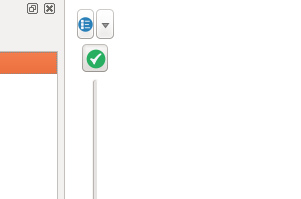

## Week 10 | March 22, 2018
*Instructor: Amanda Hickman*

# Story Progress

Let's touch base about where folks have needed help to get unstuck. There's no way you can learn everything you might need to know and store it in your head. So the best way we can guide you is to get you used to articulating the question you want to ask, and trying to ask it and then addressing the errors that inevitably surface.

# Next assignment

At this point everyone should have met with one of us to talk through what your pitch / reporting plan needs. If you haven't, you should.

And don't show us every last SELECT/ALTER/UPDATE query that you used. Clean your work up so that someone can replicate it without having to replicate the casting about that we all do as we find our way through this stuff. This isn't just about making busy work. These final scripts are your resource to refer back to when you inevitably find yourself facing a problem you've solved before and trying to remember the solution. They also become your resource when you shelve a story and come back to it after two months working on some other breaking project: you want to be able to get yourself back up to speed on the work you've already done.

# A Word About SQL

I've taught MySQL before, but I haven't tried to teach Postgres, mostly because it is just fussier about the SQL it will accept. A few of you hit real walls around that with cases in your column names and I apologize for not anticipating that.

The tradeoff is what we're going to start to get into this week and next, which is that we have a lot of much deeper functionality available to us in Postgres, including PostGIS.

Don't create a lot of new tables. If you need to refer back to the results of a particular query often, you can use CREATE VIEW, but creating tables will add a lot of overhead and you almost never need it.


# Digging into Mapping

Cartography and GIS aren't the same thing. We're talking about very basic maps as visualizations here. [More on that](http://maptime.io/lessons-resources/)

## Shapes, Points, Lines

### Mapping Points
"Geocoding" refers to the process of identifying an individual latitude/longitude pair for an address or other location description. To actually plot a location on a map, you need the location's latitude and longitude. `219 West 40th Street` means nothing without coordinates.

Geocoding is actually challenging because there aren't good, free resources for doing batch jobs, where many addresses are geocoded at once. My [Geocoding Tip Sheet](https://github.com/amandabee/cunyjdata/wiki/Tip-Sheet:-Geocoding) includes some helpful resources, but many city data sources actually include coordinates, so double check that, first.

If you're committed to mapping points, you may need my help geocoding them.

### Mapping Lines
No student has ever pitched me a compelling map that features lines rather than shapes or points. I did a project that drew out flight maps showing how far from home every prisoner incarcerated in Florence, CO is, but I pitched that, so it doesn't count. To draw that map I had to take a [crash course](http://flowingdata.com/2011/05/11/how-to-map-connections-with-great-circles/) in rendering lines. If you're excited about doing something like this, great! But you're going to need to install R and walk through Nathan Yau's tutorial before you do anything else.

### Mapping Polygons
Zipcodes, council districts, police precincts -- these are all polygons. Most of your maps will be in polygons. These polygons are defined in (usually) one of two specialized file formats -- a "Shapefile" or a "KML" file. The syntax of the file types varies, but they contain basically the same information -- the polygon called "Bronx CB 04" is defined by this series of lat/lon pairs. My [Shapefiles Tip Sheet](https://github.com/amandabee/cunyjdata/wiki/Where-to-Find-Shapefiles) has some excellent resources for finding shapefiles though a lot of the resources there are New York City specific.

Often (usually) your data won't include a shapefile. If you have High School graduation rates by school districts, and you want to map those, you need to find a shapefile that describes the outline of each school district, and then you need to combine that shapefile with your data, by identifying a column that the two tables have in common.

## Projections
We don't deal with [projections](http://xkcd.com/977/) much but they matter. And if you have inconsistent projections you might end up with a map where the city of [San Francisco is floating about 10 miles NE of where it belongs](https://amandabee.carto.com/viz/d42d245a-5aa2-11e5-ba80-0e853d047bba/public_map).  I had to [ask for help](https://gis.stackexchange.com/questions/162779/why-is-the-city-of-san-francsico-floating-over-point-richmond) to resolve that.

Most of the time you're going to be in WGS84.

The Wikipedia article on [web mercator](https://en.wikipedia.org/wiki/Web_Mercator) is pretty good if you're dying to understand how this all fits together, but EPSG is an obsolete acronym for European Petroleum Survey Group a scientific research group with ties to the petroleum industry. They compiled a comprehensive database of projections and coordinate systems.  

## Vectors and Rasters

We can head down some serious rabbit holes here. But it is worth understanding the distinction between a [vector](https://en.wikipedia.org/wiki/Vector_graphics) and a [raster](https://en.wikipedia.org/wiki/Raster_graphics), because they'll come up again and again in all kinds of contexts.

## Shapefiles
What is a shapefile? There are a few different widely used formats for storing geographic information. ESRI makes ArcGIS which is popular and expensive. Their shapefile format is almost universal. Google Maps uses it's own KML format.

## Asking for help

I can't say enough about the importance of learning how to ask for help. If you look at my [gis.stackexchange.com](https://gis.stackexchange.com/users/24497/amanda?tab=questions&sort=newest) profile you can see where I got stuck and then unstuck, starting back in 2013. There's a community there that is very good about [thoroughly explaining](https://gis.stackexchange.com/questions/84443/what-is-this-postgis-query-doing-to-show-great-circle-connections) what you're dealing with.

# Open QGIS

Okay, so let's actually do some mapping.

In 2011, the BLS published a [map of fatal workplace injuries](https://www.bls.gov/opub/btn/volume-2/death-on-the-job-fatal-work-injuries-in-2011.htm) by state.

What do we think of this map?

* Are these colors continuous or categorical? Should they be? Is anyone surprised that CA and TX have a lot of workplace injuries? How can we improve on this?

<!-- Takeaway: BLS data is mapped, but it isn’t normalized to the population and the gradient makes no sense at all. -->

So we'll recreate it:
+ [BLS Fatality Data](data/week9/)
+ [2011 Population Estimates](https://www.census.gov/popest/data/state/totals/2011/tables/NST-EST2011-01.csv) (via [census.gov](http://www.census.gov/popest/data/historical/2010s/vintage_2011/state.html))

I already combined the Census 2011 population estimates with the BLS workplace fatality data. We're actually going to use Postgres to do the first piece of this -- we could do it just as easily in [a spreadsheet](https://www.libreoffice.org/discover/calc/) but we need the SQL practice.

```SQL
CREATE TABLE bls_fatalities_2011 (
  state character varying(20) NOT NULL,
  fatalities integer NOT NULL,
  population integer NOT NULL
);
```

Do you remember how to load data into a table?

And how are we going to normalize this?

```SQL
ALTER TABLE bls_fatalities_2011 ADD COLUMN fatality_rate float;
```

And then try out a query to fill that rate column:

```sql
SELECT *,
  ((fatalities::float/population)*100000) AS rate
  FROM bls_fatalities_2011
```

And then actually do it:

```sql
UPDATE bls_fatalities_2011 SET fatality_rate = ((fatalities::float/population)*100000);
```

Why did we have to re-cast it? Well, [because](https://dba.stackexchange.com/questions/200320/what-am-i-doing-wrong-with-my-math).
And then output it:

```sql
COPY bls_fatalities_2011 TO '~/Desktop/bls_normalized.csv' DELIMITER ',' CSV HEADER;
```

### Adding a shapefile
To actually map this, we need some states. Who keeps track of US State boundaries? [The Census](https://www.census.gov/geo/maps-data/data/tiger.html). You want "Cartographic Boundary Shapefiles" > "States". The state boundaries don't actually change, so it doesnt matter which year.

For our purposes 1:20,000,000 is plenty of resolution.

You should be able to load the zip file in as a layer.

Why does it look all squished? Once upon a time [I asked about that](https://gis.stackexchange.com/questions/167181/why-would-an-svg-output-from-cartodb-look-squished-when-the-map-doesnt), too. The answer is kind of cool. If we use the toggle on the bottom right to switch to "EPSG 54004" we get something that looks a little more familiar.  


### Loading a basemap

You need a basemap. The "tile map scale plugin" -- does a nice job of automatically zooming you to an available tile layer, which the other base map plugins don't do.

So go ahead and download the plugin. `Plugins > Manage and Install Plugins ...`  and search for "Tile Map Scale"



That will give you a tiny pulldown on the map that lets you add a base layer so you can see where you are in the world.

### QGIS Built In Join

Add your CSV to QGIS (it has no geometry.)

Look at the Attribute table for the Shapefile. How are we going to join this?

And then style it.

* Use equal intervals. [I found a bug once](https://gis.stackexchange.com/questions/84562/am-i-misunderstanding-equal-interval) which is another reason to ask for help. They had no idea.

* Make compound labels with the `||` operator. Eg. `NAME  || '\n' || "bls_fatalities_2011_Workplace Fatalities 2011"`


## Keep going with QGIS

This series is highly recommended:
<https://www.youtube.com/watch?v=Pf9cYvaCYWA&index=3&list=PL7HotvlLKHCs9nD1fFUjSOsZrsnctyV2R>


# Advanced query
We probably won't get to this. And this week all we're going to do is talk it through. We're not going to tackle it.

In 2006, California voters passed [Prop 83](http://www.lao.ca.gov/ballot/2006/83_11_2006.htm), which requires registered sex offenders to live at least 2000 feet from any school or playground. In 2015, the state supreme court said the [blanket restriction was too broad](https://www.nbclosangeles.com/news/local/California-Loosens-Sex-Offender-Residency-Restrictions-297740931.html) and the law could only be applied to offenders whose crimes involved children.

Sex offender restrictions buffered around schools to show how much of a city is off limits.
* Walk through how we would do it, in theory. What do we need?

```
+ location of every public school in the county
+ location of every private school in the county
+ location of every playground in the county
```

Alameda publishes at least the schools: <https://data.acgov.org/Education/Alameda-County-Schools/yza6-6jwu>

Then we're going to need a way to calculate circles around those points. I want you to take five minutes to think of a Google search that might let you get at that. Put your search terms in the Etherpad.

<!-- http://postgis.net/docs/ST_Buffer.html -->


More applications of this? If you aren't following SB 827 you should be. So how would you map the impact of that bill? <https://transitrichhousing.org/> tried.

Or you can do something like analyze how far people in various communities have to travel to [access an abortion clinic](https://pudding.cool/2017/09/clinics/). Often, as NPR found, [the nearest clinic is hundreds of miles away](https://www.npr.org/sections/health-shots/2017/10/03/555166033/for-many-women-the-nearest-abortion-clinic-is-hundreds-of-miles-away).


# Homework
Spend some time in your shapefile and describe, in words, a join that you can use to populate it with data. What column

I keep a [list of shapefile sources](https://github.com/amandabee/CUNY-SOJ-data-storytelling/wiki/Where-to-Find-Shapefiles), and a [list of geocoders](https://github.com/amandabee/CUNY-data-storytelling/wiki/Tip-Sheet:-Geocoding) which you'll need if you have addresses, but no latitude or longitude.

The Data of the Week is in a Google Spreadsheet. [Who is up after the break?](https://docs.google.com/spreadsheets/d/11JLkkyWZf3fvVz3aebgMjcZ6mxV-j5Gw7hEpeiPAGY4/edit#gid=0).
