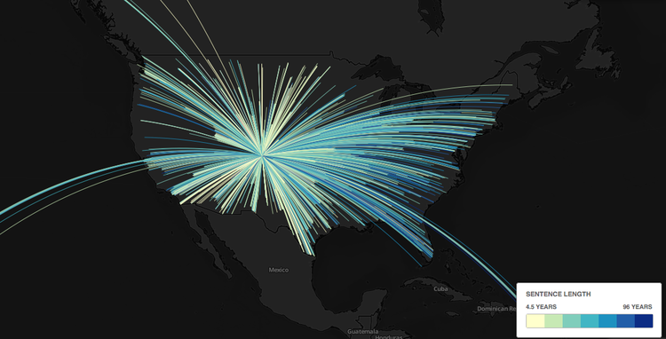
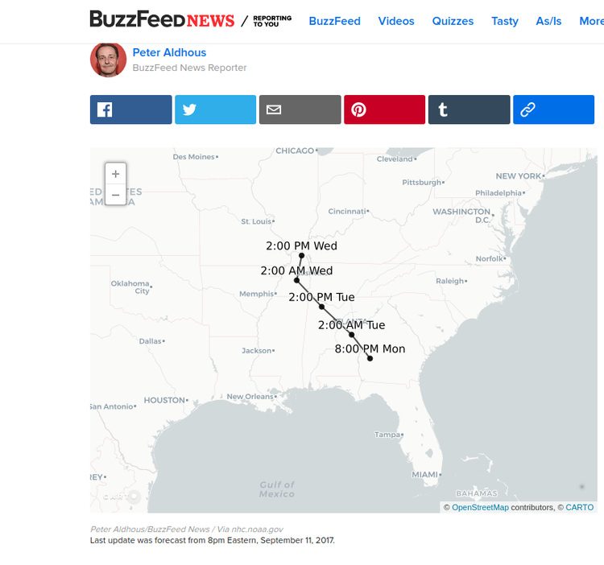

## Week 11 | April 5, 2018
*Instructor: Amanda Hickman*

# Data of the Week

Who is on [the presentation schedule](https://docs.google.com/spreadsheets/d/11JLkkyWZf3fvVz3aebgMjcZ6mxV-j5Gw7hEpeiPAGY4/edit#gid=0)?

# A few QGIS Notes

* You can save your work as an image. Or as an SVG (`file > print composer`)

## Strategies for Slow Computers

We already used [`head`](https://www.gnu.org/software/coreutils/manual/html_node/head-invocation.html) (with the [`-n 100` flag](https://en.wikipedia.org/wiki/Head_(Unix)) set, to output the first hundred lines of a file. Another good option is to just create a smaller table to work with:

```SQL

CREATE TABLE example_shorter AS
  SELECT * FROM example LIMIT 1000;

```

This will let you stumble around and figure out what you're trying to do without waiting for your computer to catch up with a larger data file. If QGIS is so slow that you can't get much done there are a few other good options to look into:

* Actually **create a spatial index**. We'll do this to a data set today. We haven't talked a lot about indexing but it's (roughly) the process of creating a structured view of the data so that the computer can find it quickly. If you know you want to be able to search a particular column regularly, for instance, you'd want to create a search index for that column. This is more advanced than we need to go deep on, but creating a spatial index is always a good idea.

* Turn off rendering (there's a checkbox in the lower right) so that QGIS isn't continually trying to re-draw.

* Ask for help! If you're doing just fine with a smaller file, but the larger file is choking, there may be some ways to smooth it. The [options will vary](https://gis.stackexchange.com/questions/67736/qgis-very-slow-i-dont-know-what-to-do#67779) depending on your particular case so getting good at asking questions is key. I can't reiterate this enough.

* Can you make your file smaller?


# Adding PostGIS to QGIS

Few setup steps:

```sql

CREATE DATABASE week11_postgis;

/* make sure you're using it. */

CREATE EXTENSION postgis;


```

## Puzzle One: Why Aren't Todd's Points Showing Up?

When you import a CSV into QGIS directly, you have two options. If there's a latitude column and a longitude column you can just select "Point coordinates" as your Geometry definition, and identify the X (longitude) and Y (latitude) columns. The other option is [Well Known Text](https://en.wikipedia.org/wiki/Well-known_text) which is a standardized format for identifying points, lines and polygons. WKT wants point definitions as `POINT (lon lat)`.

If your data has a single column that you know includes the latitude and longitude but it isn't in WKT format:

    location
    (37.7875044952742, -122.414163693123)
    (37.7657922226195, -122.420909958943)
    (37.7657922226195, -122.420909958943)
    (37.7657922226195, -122.420909958943)
    (37.7657922226195, -122.420909958943)
    (37.7657922226195, -122.420909958943)
    (37.783163427134, -122.411599278937)
    (37.783163427134, -122.411599278937)

You have a few options. You can use Open Refine to break out the latitude and longitude into their own columns. You could use a spreadsheet function, if your data is small enough to open in a spreadsheet. You could use SQL in postgres to find [substrings](https://www.postgresql.org/docs/8.1/static/functions-string.html) and pull them into their own column.

Start by building up the `SELECT` statement:

```sql
SELECT location,
	btrim(location, '()'),
	split_part(location, ',', 1),                 
	split_part(btrim(location, '()'), ',', 1),
	split_part(btrim(location, '()'), ',', 2)
	FROM example;
```

Then pull it into it's own column:

```sql

ALTER TABLE example
  ADD COLUMN longitude FLOAT,
  ADD COLUMN latitude FLOAT;


UPDATE example SET longitude = split_part(btrim(location, '()'), ',', 2),
                latitude = split_part(btrim(location, '()'), ',', 1);

```

Read the error message. What does it actually say?

```sql

UPDATE example SET longitude = split_part(btrim(location, '()'), ',', 2)::float,
                 latitude = split_part(btrim(location, '()'), ',', 1)::float;

```

Then you can export to a CSV and import the CSV into QGIS. But the whole point here is to start introducing PostGIS. So let's.

The first thing we need to do is actually `CREATE EXTENSION postgis;` -- but we've done that. So then we need to generate points in a format that


### [ST_MakePoint](https://postgis.net/docs/ST_MakePoint.html)

```sql
ALTER TABLE example ADD COLUMN geom GEOMETRY;
UPDATE example SET geom =  ST_MakePoint(longitude, latitude);
```

So now we need to connect in QGIS. You can go to `Layer > Add Layer > Postgis` or look for the elephant on the sidebar.

The connection settings are probably the same as for Postico.

Once you've successfully connected, you might have to look for the "Also list tables with no geometry" check box, and check it.

A few more observations:

* The distinction between GEOGRAPHY and GEOMETRY [is fuzzy](https://postgis.net/docs/manual-2.1/using_postgis_dbmanagement.html#PostGIS_GeographyVSGeometry) but my general rule is that I use GEOMETRY until I get stuck and then I adjust.
* It is important to get used to thinking in terms of tables and to recognize that this data is all super accessible.
* It is important to get to a place where you can frame the question in front of you in a meaningful way.
* The QGIS documentation is really bad. But the [PostGIS documentation](http://postgis.net/docs/manual-2.4/) is great.
* Using the "geom" convention is optional but it will save you a lot of aggravation.

## Tidying

Look for `Database > DB Manager` in the menu. You should be able to drill down to `PostGIS > Localhost > public > {tablename}` and you'll see some warnings.

>    No spatial index defined (create it)
>    There is no entry in geometry_columns!
>    No primary key defined for this table!

You can actually charge ahead without addressing any of these warnings, but when you hit a wall, the first troubleshooting step is always to address any warnings, so do that.

Use the "create it" link to create a spatial index, or you can create it with:

```SQL
CREATE INDEX sidx_example_geom ON public.example USING gist (geom);
```

Register this table with QGIS (to create an entry in `geometry_columns`) with [`Populate_Geometry_Columns`](https://postgis.net/docs/Populate_Geometry_Columns.html):

```sql
SELECT Populate_Geometry_Columns('example'::regclass);
```
Add a primary key, with:  

```sql
ALTER TABLE example ADD PRIMARY KEY (call_number, unit_id);
```

## What Do We Want To Accomplish?

* Find all of the zipcodes that are inside of Alameda county. Start by spelling out how you'd approach this. Can you describe in words what you're trying to do?

We're looking for a way to capture all the shapes in one layer that intersect with a single shape in another layer.

The census publishes zipcode maps of the US:
https://www.census.gov/geo/maps-data/data/cbf/cbf_zcta.html

We already have a map of US states, from [Week 9](data/week9/) -- we're going to start with California.

### Load into Postgres
To use these in PostGIS, we need to convert them into SQL, but you've got a built in terminal utility, `shp2pgsql` that does exactly that:

```
shp2pgsql cb_2016_us_zcta510_500k.shp zipcodes postgres > cb_2016_us_zcta510_500k.sql
shp2pgsql gz_2010_us_040_00_20m.shp us_states postgres > gz_2010_us_040_00_20m.sql
```

You can either use Postico's "load query" button, or load these right at the command line with:

```
psql -d week11_postgis -f cb_2016_us_zcta510_500k.sql
psql -d week11_postgis -f gz_2010_us_040_00_20m.sql
```

### Find Your PostGIS command

There are a few that sound like they might be what we want: [ST_Within](http://postgis.net/docs/ST_Within.html), [ST_Contains](http://postgis.net/docs/ST_Contains.html),  [ST_Intersection ](http://postgis.net/docs/ST_Intersection.html),  [ST_Intersects](http://postgis.net/docs/ST_Intersects.html). Take a look at the documentation: how do these differ?


```SQL

SELECT
  us_states.geom AS state_gom,
  us_states.state AS state,
  zipcodes.zcta5ce10 AS zipcode,
  zipcodes.geom as zip_geom
FROM
  us_states, zipcodes
WHERE
  ST_Intersects(zipcodes.geom, us_states.geom) AND us_states.name = 'California';

```

So then we have a smaller set that we can work with, so let's actually make a table out of that:

```sql
CREATE TABLE ca_zipcodes AS
  SELECT zipcodes.* FROM zipcodes, us_states
  WHERE ST_Intersects(zipcodes.geom, us_states.geom) AND us_states.name = 'California';
```

### Your Turn

Alameda County publishes a [county boundary file](https://data.acgov.org/Geospatial-Data/County-Boundary/rygg-x9nr). So try it again. Remember that your steps are:

1. Use `shp2pgsql` to convert the Shapefile into SQL.
2. Import the SQL into Postgres.
3. Index it (you can do this in QGIS, or you can look at your table definitions from the last exercise and see if you can guess the SQL statement that will index your table.)
4. Use [ST_Intersects](http://postgis.net/docs/ST_Intersects.html) to find all the zipcode shapes that intersect with Alameda county.

You're going to wind up capturing a few zipcodes that only cross the county line in tiny spots. Can you brainstorm some ways to address those?


<!-- ## Next Challenge -->


## More things you can do:

Find the [length of each line](https://gis.stackexchange.com/questions/143436/how-do-i-calculate-st-length-in-miles) in a map of bike lanes.

Draw flight maps. Here's the [SQL](https://gist.github.com/amandabee/22cfe6588ae40f2f42f7c5a21588354f) I used, and one of the [questions](https://gis.stackexchange.com/questions/84443/what-is-this-postgis-query-doing-to-show-great-circle-connections) I asked as I was getting my bearings. And the final map:




Connect the points to trace the path of a hurricane or storm forecast.

[](https://www.buzzfeed.com/peteraldhous/hurricane-irma-predicted-track)


[](https://www.buzzfeed.com/danvergano/record-breaking-hurricane-irma)


# Lab

Everyone has got a lot to work on, so let's spend some time in it.


# Homework: Reporting Plan

At this point everyone should have met with one of us to talk through what your pitch / reporting plan needs.

The next update to your data journalism project is due **Saturday April 7 at 8 pm**.

Updates should be cumulative: your submission should include everything we need to evaluate your work. At this point you should be making progress both in analyzing your data and understanding the underlying story or potential stories. With this update, you should clearly and concisely:

    + Describe the analysis you have conducted so far. Frame your description in terms of the questions you have asked of the data, and the answers you have obtained. Include the data you are using, a description of how you obtained it, and any code you have used for your analysis.

    + In clear sentences, describe the main conclusions you have drawn so far from your analysis.

    + Describe the further questions you wish to ask of your data.

    + Describe any obstacles you face. Important: you should be seeking help from your instructors when you get stuck! Do not wait until this assignment deadline for that.

    + Outline the additional reporting, beyond data analysis, that would be required to turn this project into a story.

We do want to see the code you have used in your analysis, but please do not show us every last SELECT/ALTER/UPDATE query that you used. Clean your work up so that someone can replicate it without having to replicate the casting about that we all do as we find our way through this stuff. This isn't just about making busy work. These final scripts are your resource to refer back to when you inevitably find yourself facing a problem you've solved before and trying to remember the solution. They also become your resource when you shelve a story and come back to it after two months working on some other breaking project: you want to be able to get yourself back up to speed on the work you've already done.
