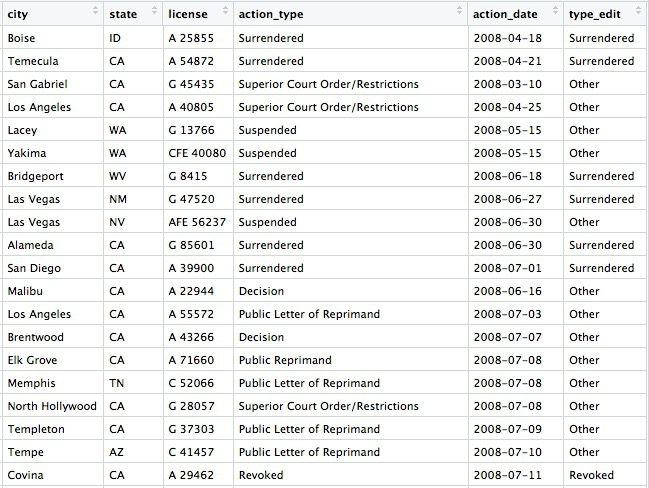
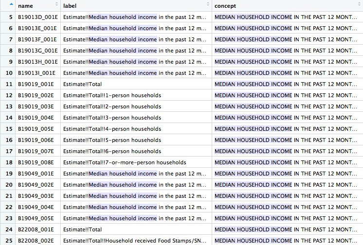
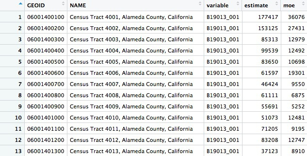
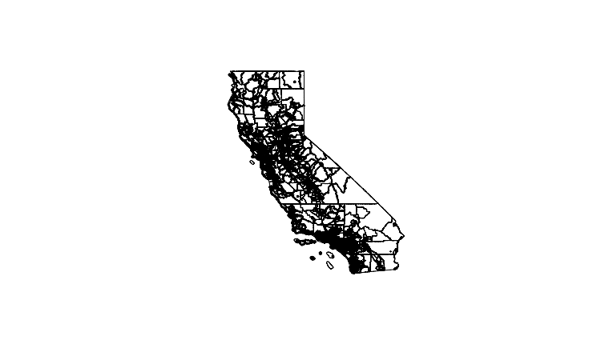
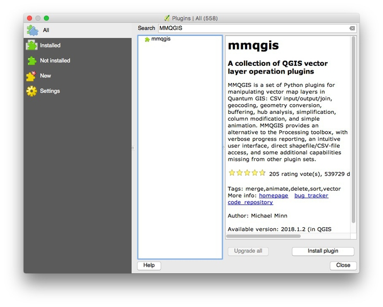
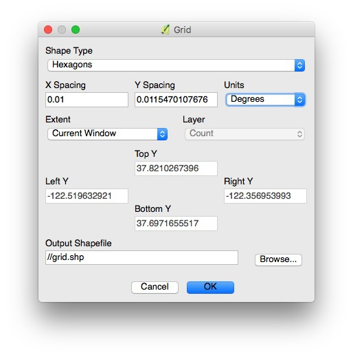
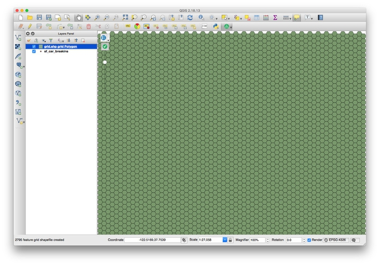
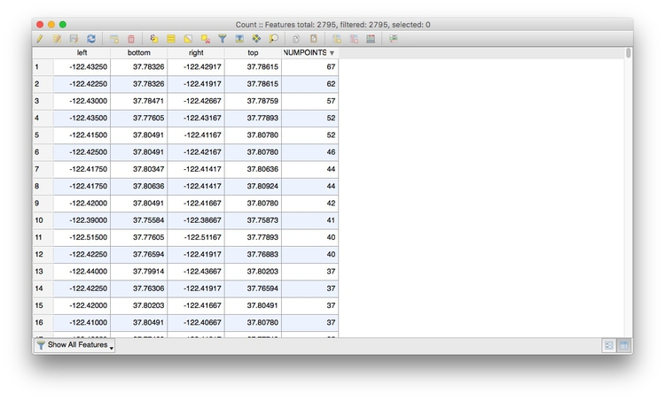
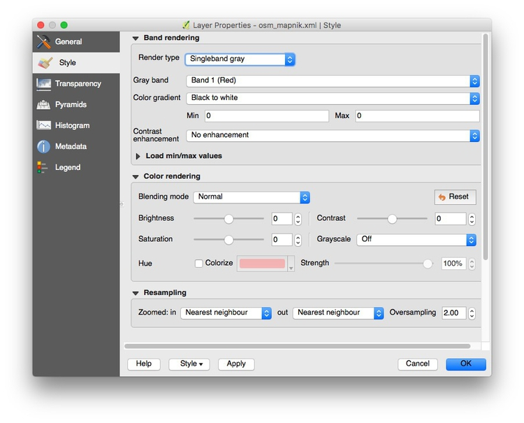
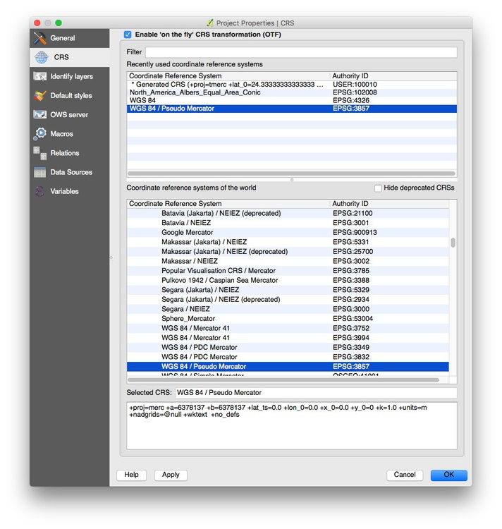

# More fun with R (and QGIS)

The goal of today's class is to show you some more advanced teachniques in R, beyond using **dplyr** for our basic operations with data:

- **Sort:** Largest to smallest, oldest to newest, alphabetical etc.

- **Filter:** Select a defined subset of the data.

- **Summarize/Aggregate:** Deriving one value from a series of other values to produce a summary statistic. Examples include: count, sum, mean, median, maximum, minimum etc. Often you'll **group** data into categories first, and then aggregate by group.

- **Join:** Merging entries from two or more datasets based on common field(s), e.g. unique ID number, last name and first name.

The examples below have been chosen to reflect some of the problems encountered in students' project work. I don't suggest trying to follow along today, but rather focus on understanding what I show you. You can work through the examples at your leisure, or modify them to apply to your project. To run the code, you will need to install any required packages that are not already in listed in your RStudio `Packages` tab.

The message from thesse examples is that R is an incredibly powerful tool, capable of performing just about any analysis or data processing task you can imagine. Once you get confident in R, you'll get used to looking for code examples and tutorials to solve the problems you encounter when working with data. That's how I learned everything outlined below.

If you're not sure what you are doing, however, seek help! The [NICAR listserv](https://www.ire.org/resource-center/listservs/subscribe-nicar-l/), the main online discussion forum for data journalists, is a great place to start.

### The data we will use

Some of the data will be loaded using web [Application Programming Interfaces](https://en.wikipedia.org/wiki/Web_API) that are set up to provide data on demand online.

The rest of the data is [here](data/week14.zip); unzip the folder and place it on your desktop. It contains the following folders and files:

- `ca_discipline` Folder containing multiple CSV files, one for each each, detailing disciplinary alerts and actions issued by the Medical Board of California from 2008 to 2017. Processed from downloads available [here](http://www.mbc.ca.gov/Publications/Disciplinary_Actions/). Each file contains the following variables:

	- `alert_date` Date alert issued.
	- `last_name` Last name of doctor/health care provider.
	- `first_name` First name of doctor/health care provider.
	- `middle_name` Middle/other names.
	- `name_suffix` Name suffix (Jr., II etc)
	- `city` City of practice location.
	- `state` State of practice location.
	- `license` California medical license number.
	- `action_type` Type of action.
	- `action_date` Date of action.

- `ca_tracts` Shapefile of Census tracts in California, from the [US Census Bureau](https://www.census.gov/geo/maps-data/data/tiger-line.html).

- `oakland_eei.csv` Data on educational attainment of children from low-income families (those qualifying for free or reduced price lunch) for schools in Oakland in 2015, originally compiled by [Education Cities](http://www.educationcities.org/) for the [Education Equality Index](https://www.educationequalityindex.org/), and processed/simplified for this class (there is more data available). Contains the following variables:
 - `school_name`
 - `eei_score` School performance, based on tests for all subjects and grades, on a 0-100 scale.
 - `charter` Is the school a charter school? `N` or `Y`.
 - `pc_black` `pc_white` `pc_hispanic` Percent of students from each of these racial/ethnic groups.
 - `enroll_100` Total number of students at the school, in multiples of 100.
 - `pc_fr_lunch` Percentage of students on free or reduced price lunch.


### Setting up

As usual, open RStudio, create a new script, save it into the folder with the data for this class, then set your working directory to the same folder.

### Reading in multiple files, combining into a single data frame

Often data comes in a series of files, which you need to read into R and combine into a single data frame. This can be achieved using a **for loop**, a useful programming trick that allows you to iterate through a list of items, performing the same series of actions on each item. To obtain a single data frame with all the Medical Board of Califoria disciplinary actions from 2008 to 2017, we need to read in each file, and append it to the same data frame.

This is how to do it:

```R
# required packages
library(readr)
library(dplyr)

# list files
files <- list.files("ca_discipline")

# create empty data frame
ca_discipline <- data_frame()

# loop to read in files, and append them to that data frame
for (f in files) {
  print(f)
  tmp <- read_csv(paste0("ca_discipline/",f), col_types = cols(
    .default = col_character(),
    alert_date = col_datetime(),
    action_date = col_datetime()))
  ca_discipline <- bind_rows(ca_discipline,tmp)
}

# cleanup
rm(tmp,files,f)

```

**For loops** in R have this general format:

```R
for (item in list) {
	# Do stuff involving each item
}
```
`item` can have any name you like; I usually give it the first letter of the name of the list I'm iterating through.

This example uses the function `list.files` to list all the files in the folder `ca_discipline`, then makes an empty data frame called `ca_discipline` using the **dplyr** function `data_frame`.

The loop prints each file name, then uses the `read_csv` function from **readr** to load each file into a temporary data frame called `tmp`, which gets overwritten in each iteration of the loop. The final step in each iteration of the loop is to append `tmp` to the `ca_discipline` data frame using the dplyr function `bind_rows`.

The `read_csv` function is a little more complicated than we've seen before. Because the files are in the `ca_discipline` folder, the location of each must be defined as `ca_discipline/f` using the `paste0` function, which concatenates strings of text.

The `read_csv` function also defines the default data type for columns in the data, and gives the data type for any exceptions. Explicitly decaring the data types in a loop like this is a good idea, because any inconsistency in data types for each `read_csv` may otherwise cause the `bind_rows` function to fail. (Other data types include `col_integer()` for whole numbers and `col_double()` for numbers that may include decimal fractions.)

The `rm` function removes objects from your environment.

### Making new variables with conditional statements

Often you need to make new columns in your data, particularly when simplifying a categorical variable with many categories into something more manageable. This can be done with in a **dplyr** `mutate` using the function `case_when`, which applies conditional statements.

Continuing from the example above, this code simplifies the `action_types` variable into a new variable `type_edit` with just three possibilities: `Revoked`, `Surrendered`, or `Other`.

```R
ca_discipline <- ca_discipline %>%
  mutate(type_edit = case_when(action_type == "Revoked" ~ "Revoked",
                               action_type == "Surrendered" ~ "Surrendered",
                               !grepl("Revoked|Surrendered", action_type) ~ "Other"))
```

View the data to see the new row:




### Working with Census data and shapefiles, and writing geographic data to PostgreSQL/PostGIS

R can process and analyze geographic data, and then write the results to PostgreSQL for mapping in QGIS and further analysis with PostGIS. To see this in action, we'll first work with some Census data, which can be loaded using [US Census APIs](https://www.census.gov/data/developers/data-sets.html) with the **[tidycensus](https://walkerke.github.io/tidycensus/)** package, and Census shapefiles, which can be loaded using the **[tigris](https://cran.r-project.org/web/packages/tigris/tigris.pdf)** package. In addition to **dplyr**, this example uses **[rgdal](https://cran.r-project.org/web/packages/rgdal/rgdal.pdf)**, which reads and writes geographic data and handles its projection; [RPostgreSQL](https://cran.r-project.org/web/packages/RPostgreSQL/RPostgreSQL.pdf), which connects to a PostgreSQL database; and **[rpostgis](https://cran.r-project.org/web/packages/rpostgis/rpostgis.pdf)**, to write geographic data into a PostGIS-enabled database table.

First, load all of the packages required for this example:

```R
# load required packages
library(dplyr)
library(tidycensus)
library(tigris)
library(rgdal)
library(RPostgreSQL)
library(rpostgis)
```

**tidycensus** can pull data from the Census itself, run every 10 years, or the [American Community Survey](https://www.census.gov/programs-surveys/acs/), an annual snapshot of the country which extrapolates from samples, producing estimates for variables(median household income, population for various races and ethnicities, and so on) for the last year, the last 3 years, or the last 5 years, for geographies of various types. The smaller the geographic area and the shorter the time period, the wider the margin of error. So when analyzing data from small geographic areas, such as Census tracts, it's generally wise to use the 5-year estimates.

To pull data from a US Census API, you need a Census API key, which you can request from [here](https://api.census.gov/data/key_signup.html).

This code creates a data frame showing all of the variables measured in the 2016 5-year American Community Survey:

```R
# load Census API key
census_api_key("your key goes here", install = TRUE)

# get variables acs_2016 5 year estimates
acs_2016_variables <- load_variables(2016, "acs5", cache = TRUE)
```
View the data frame and use the search box to find the variables you need. Search for "median household income" and you should see the following:



You will need to read the text under `concept` to see which variable you want. For the median household income across all households, irrespective of their size, the variable is `B19019_001E`. The `E` simply means "estimate", and should be dropped when loading the variable using **tidycensus**.

The following code gets the median household income for all census tracts in California, as recorded in the 5-year estimates of the 2016 American Community Survey:

```R
# use tidycensus to get data on medium household income for all Census tracts in California
ca_tracts <- get_acs(state = "CA",
                     year = 2016,
                     survey = "acs5",
                     geography = "tract",
                     variables = "B19013_001",
                     output = "tidy",
                     geometry = FALSE)
```

This should return a data frame with 8057 rows, giving the `estimate` and margin of error (`moe`) for each tract. Each tract also has an unique code, `GEOID`:



You can change the year and survey: use `acs3` for 3-year estimates, for example. Available geographies include `county` and `zcta`, for [zip code tabulation areas](https://www.census.gov/geo/reference/zctas.html); but don't specify a state when using `ztca`, because zip codes can cross state lines. (`get_decennial` is the equivalent function for pulling data from the full Census.)

Now we can use **tigris** to load a shapefile for California Census tracts, and produce a rough plot:

```R
# Use tigris to load shapefile for Census tracts in California
ca_tracts_map <- tracts(state = "CA", year = 2016)

# plot
plot(ca_tracts_map)
```
The plot should look like this:



Often you won't be able to load shapefiles from an API. But if you have downloaded a shapefile to your computer, you can load it like this:

```R
# read in a shapefile from your computer
ca_tracts_map <- readOGR("ca_tracts_map", "ca_tracts_map")
```
This code uses the `readOGR` function from **rgdal**; the first mention of `ca_tracts_map` refers to the folder containing the shapefile, the second to the root name of all the files within.

Whether loading using **tidycensus** or from a saved shapefile, the data will load as a `SpatialPolygonsDataFrame`. Inspect the data connected to the map with this code:

```R
# View the data associated with the map
View(ca_tracts_map@data)
```
`@` specifies a particular attritubute of a spatial data frame, here its table of associated data.

The data associated with the map also contains `GEOID` codes for each tract:


Now use **dplyr** to join the median housefold income data to the map, based on matching `GEOID` codes:

```R
# join the median household income data to the map
ca_tracts_map@data <- inner_join(ca_tracts_map@data, ca_tracts, by = "GEOID")

# check the join has worked
View(ca_tracts_map@data)
```

Having joined the data you can export the shapefile to your computer like this:

```R
# write out a shapefile 
writeOGR(ca_tracts_map, "ca_tracts_income", "ca_tracts_income", driver = "ESRI Shapefile")
```

If you have your Postgres app running, you can also upload the spatial data frame straight to PostgreSQL/PostGIS like this:

```R
# create new database, if required
system("createdb week14")

# set up connection to that database
drv <- dbDriver("PostgreSQL")
con <- dbConnect(drv, dbname = "week14", host = "localhost")

# reproject the data frame to the standard EPSG:4326
ca_tracts_map <- spTransform(ca_tracts_map, CRS("+init=epsg:4326"))

# insert into a PostGIS-enabled table
pgInsert(con, 
         name = "ca_tracts_income", 
         data.obj = ca_tracts_map, 
         geom = "geom", 
         overwrite = TRUE, 
         df.mode = FALSE, partial.match = FALSE, new.id = NULL,
         row.names = FALSE, upsert.using = NULL, 
         alter.names = FALSE, encoding = NULL, return.pgi = FALSE)
```
The `system` function, from base R, sends a command to your computer's Terminal, here to create a new database.

`dbDriver` and `dbConnect` are functions from **RPostgreSQL**, used to establish a connection to that database.

PostGIS normally expects tables to be in a standard Coordinate Reference Rystem called `EPSG:4326`(this is also the default in QGIS). So before uploading to PostgreSQL/PostGIS, use the `spTransform` function from **rgdal** to ensure your data is in this format.

Finally, use the `pgInsert` function from **rpostgis** to write the data into a PostGIS-enabled table; `name` defines the name of the new table, `data.obj` is the name of the spatial data frame in your R environment. If you want to append data to an existing table, use `overwrite = FALSE` (using the code above, with `overwrite = TRUE`, any existing table with the same name would be overwritten).

You may find it much more convenient to load maps into PostgreSQL/PostGIS from R than by the methods you've used previously.

Now you can load your map into QGIS as we did previously.

### More with R, PostgreSQL, and QGIS: thefts from vehicles in San Francisco

This example uses another API, shows how to turn data with latitude and longitude coordinates into a spatial data frame, and introduces hexagonal binning to analyze the density of points in QGIS.

These are the required packages:

```R
# load required packages
library(dplyr)
library(rgdal)
library(RPostgreSQL)
library(rpostgis)
library(jsonlite)
```

If continuing from the example above, you only need load **[jsonlite](https://cran.r-project.org/web/packages/jsonlite/jsonlite.pdf)**, which can read data from JSON into an R data frame.

[This page](https://data.sfgov.org/Public-Safety/Police-Department-Incidents-Current-Year-2018-/956q-2t7k) at DataSF contains incidents responded to by the San Francisco Police Department in 2018. The data is updated daily, with the most recently added incidents running two weeks behind the current date.

With frequently updated data like this, it's a good idea to work with a script that can pull in the latest version of the data, rather than a downloaded snapshot. Then your analysis can be updated by simply running the entire script.

If you click on `Export` on the 2018 police incidents page, one of the options is to obtain the data using [Socrata's SODA API](https://dev.socrata.com/):


(Socrata is a company used by many state and local governments to put their data online.)

Notice that the endpoint is `https://data.sfgov.org/resource/956q-2t7k.json`. The SODA API includes many options, but to simply load the entire dataset into R, the code is simple:

```R
# get San Francisco 2018 police incident data
incidents <- fromJSON("https://data.sfgov.org/resource/956q-2t7k.json?$limit=50000")

# check the data types for the data returned
glimpse(incidents)
```
If you don't specify a limit, [only the first 1,000 rows](https://dev.socrata.com/docs/queries/limit.html) will be returned; use trial and error with the limit to make sure you get all the data.

This was the result of the `glimpse` on April 24, 2018:
```CSS
Observations: 26,688
Variables: 13
$ date       <chr> "2018-04-01T00:00:00", "2018-03-19T00:00:00", "2018-03-19T00:00:00", "2018-01...
$ address    <chr> "0 Block of ROBINSON DR", "JOHNMUIR DR / LAKE MERCED BL", "800 Block of BRUNS...
$ resolution <chr> "NONE", "NONE", "NONE", "NONE", "NONE", "NONE", "NONE", "NONE", "ARREST, BOOK...
$ pddistrict <chr> "INGLESIDE", "TARAVAL", "INGLESIDE", "INGLESIDE", "INGLESIDE", "INGLESIDE", "...
$ incidntnum <chr> "180250054", "180208241", "186066502", "180018238", "180047271", "186033852",...
$ x          <chr> "-122.42871668187439", "-122.4857362496041", "-122.45048298008807", "-122.420...
$ dayofweek  <chr> "Sunday", "Monday", "Monday", "Sunday", "Thursday", "Friday", "Wednesday", "W...
$ y          <chr> "37.70792190345863", "37.70815359983144", "37.70817029170297", "37.7083109744...
$ location   <data.frame> c("37.70792190345863", "37.70815359983144", "37.70817029170297", "37.7...
$ time       <chr> "00:01", "19:15", "00:01", "16:40", "15:15", "00:01", "13:06", "12:00", "08:4...
$ pdid       <chr> "18025005405041", "18020824128150", "18606650206244", "18001823804134", "1800...
$ category   <chr> "BURGLARY", "VANDALISM", "LARCENY/THEFT", "ASSAULT", "SUSPICIOUS OCC", "NON-C...
$ descript   <chr> "BURGLARY OF RESIDENCE, FORCIBLE ENTRY", "MALICIOUS MISCHIEF, VANDALISM", "GR...
```
`location` is a data frame within this data frame, and every other variable is treated as text. So remove the location column and process the data with **dplyr** as follows:

```R
# this ensures no loss of decimal places when converting text values for latitude and longitude
options(digits = 17)

# process the data
incidents <- incidents %>%
 select(-location) %>%
  mutate(date = as.Date(date),
         latitude = as.double(y),
         longitude = as.double(x),
         hour = as.integer(substr(time,1,2)))
```
When using `select`, putting a dash in front of a column removes it from the data. So this code removes the nested data frame, converts the dates into dates, and creates new numeric columns for latitude, longitude, and the hour of the day on the 24-hour clock. The `substr` function extracts part of a string of text, here the first two numbers in the `time` variable.

Theft from cars is a big issue in San Francisco, but we want to ensure that we include all crime categories and descriptions that might be relevant:

```R
# find categories and descriptions for thefts
theft_types <- incidents %>%
  filter(grepl("theft|larceny", category, ignore.case=TRUE)) %>%
  select(category, descript) %>%
  unique()
```
From the data returned from this code, it seems we need to filter the data to include petty or grand left from locked or unlocked autos:

```R
# filter grand or petty theft from locked or unlocked auto
car_breakins <- incidents %>%
  filter(grepl("grand|petty", descript, ignore.case = TRUE)
         & grepl("unlocked auto|locked auto", descript, ignore.case = TRUE))

# check the crime descriptions resulting from that filter
car_breakin_types <- car_breakins %>%
  select(descript) %>%
  unique()
```
View these two data frames to check that the data has filtered correctly.

The temptation is to load the data straight into PostgreSQL for mapping, but let's first take a look at the addresses that show up most often in the data.

```R
# count car breakins by address
car_breakin_locations <- car_breakins %>%
  group_by(address) %>%
  summarize(count = n()) %>%
  arrange(desc(count))
```
Here are the top ten addresses:


Wow, there seems to be an epidemic of car break-ins on the 800 block of Bryant Street! What could be going on? Let's take a look at what's there:


The San Francisco Hall of Justice is at 850 Bryant. Do we think that's a real hotspot, or is it more likely that incidents without another location are being mapped to the courthouse by default? You'd want to speak to the person at SFPD who manages this data to find out, but I'm going to exclude this suspicious data before loading to PostgreSQL/PostGIS.

```R
# remove incidents on 800 block of Bryant 
car_breakins <- car_breakins %>%
  filter(!grepl("800 block of bryant", address, ignore.case = TRUE))
```

Now write the data to PostgreSQL/PostGIS:

```R
# you may need this line if your data frame is a tbl_df 
car_breakins <- as.data.frame(car_breakins)

# make a data frame with just the latitude and longitude coordinates
xy <- car_breakins %>%
  select(longitude,latitude)

# convert to a spatial points data frame
car_breakins <- SpatialPointsDataFrame(coords = xy, 
                                       data = car_breakins, 
                                       proj4string = CRS("+init=epsg:4326"))

# set up local connection to the database
drv <- dbDriver("PostgreSQL")
con <- dbConnect(drv, dbname = "week14", host = "localhost")

# insert into a PostGIS-enabled table
pgInsert(con, 
         name = "sf_car_breakins", 
         data.obj = car_breakins, 
         geom = "geom", 
         overwrite = TRUE, 
         df.mode = FALSE, partial.match = FALSE, new.id = NULL,
         row.names = FALSE, upsert.using = NULL, 
         alter.names = FALSE, encoding = NULL, return.pgi = FALSE)
```

This code converts a regular data frame with latitude and longitude columns into a spaital data frame that can be mapped as points. If you have used **readr** to read in your data, it will be in `tbl_df` format, and you will need the first line to convert to a plain data frame.

The key step is to create a data frame called `xy` that has the data in the same row order (do not sort!), and just the columns `longitide` and `latitude` in that order. The `SpatialPointsDataFrame` function then uses this to convert the data to a spatial data frame, setting the Coordinate Reference System to `EPSG:4326`. (`SpatialPointsDataFrame` is from the **[sp](https://cran.r-project.org/web/packages/sp/sp.pdf)** package, which loads automatically with **rgdal**).

Writing the data to PostgreSQL/PostGIS is exactly as in the previous example.

Now we can switch to QGIS to map hotspots for car break-ins. For this we will use a QGIS Plugin called `MMGQIS`. Install it by selecting `Plugins>Manage and Install Plugins...` from the top menu. At the dialog box, search for MMGIS and install the plugin:



Now load the data in the `sf_car_breakins` table:


The problem with data like this is that points may be layered over the top of one another, which makes it hard to assess where the real hotspots are. One way around this is to impose a hexagonal grid on the map, and then count the points in each cell of the grid.

Select `MMQGIS>Create>Create Grid Layer` from the top menu and fill in the dialog box like this:



In practice, you will need to experiment with `X Spacing` (`Y spacing`) will adjust automatically, to get a grid with cells of reasonable size.

Now `Browse...` to save the shapefile that will be created into your data folder, in a new folder called `grid`, and click `OK`.

This should be the result:



Now select `Vector>Analysis Tools>Count points in polygon` from the top menu, and click `Run` at the dialog box:


This will create a new layer, `Count`, with an Attribute Table with the count of the points in each grid cell in a column called `NUMPOINTS`:



Right-click on the `Count` layer, select `Save As...` and save as an `ESRI Shapefile` in a new folder within your data folder.

Now create a new QGIS project and pull in an Open Streetmap layer using the Tile Map Scale Plugin. Right click on the layer, select `Proporties` and change its `Render type` to `Singleband gray` to obtain a neutral gray basemap:



Select `Project>Project properties from the top menu and check `Enable 'on the fly' CRS transformation (OTF)`, and click `OK`:



This will ensure that subsequent layers will be reprojected to the Web Mercator projection used by the basemap.

To load the gridded car break-in hotspot shapefile, click the `Add Vector Layer` icon, and browse to the shapefile we just made:


Zoom to this layer, then style it to make the layer semi-transparent, and with a `Graduated` color ramp based on the values in the `NUMPOINT` column. The map should now look something like this:


Zoom into the concentrations of darker hexagons. Why do you think these areas are hotspots for car break-ins?

### Analyzing data when several variables may influence an outcome: When to use regression analysis

Often data journallists must consider how a number of different variables affect an outcome. You might, for instance, have data on bail amounts set for people charged with crimes, and want to analyze how the variables including arrestees' crimes, their age, and their race affects the bail amounts set.

Even if your storyfocuses on only one variable, such as the effect of race on bail amounts, simply ignoring the effect of other variables is a bad idea: You risk drawing false conclusions because of the problem of "lurking" variables, which we discussed in week 1.

In cases like this, you should consider trying regression analysis, in which you build a statistical model to describe how multiple variables affect the outcome you are analyzing.

The example that follows uses [multiple linear regression](https://www.investopedia.com/terms/m/mlr.asp) to analyze educational attainment of students from low-income families (those qualifying for free or reduced price lunch) for schools in Oakland in 2015.

First, load the required packages:

```R
# load required packages
library(readr)
library(dplyr)
library(ggplot2)
library(GGally)
library(forcats)
```

The only ones we haven't encountered before are **[GGally](http://ggobi.github.io/ggally/#ggally)** and **[forcats](http://forcats.tidyverse.org/index.html)**. **GGally** is an extension to **ggplot2** that creates specific plots that can be useful when performing statistical analyses, including regression; **forcats** is part of the tidyverse, designed for working with categorical variables; it can be used to arrange the categories of a categorical variable in a specific order, which you may need to do for a regression analysis.

#### Plotting the relationship between variables

The following code loads the data and then uses the **GGally** function `ggpairs` to plot relationships between the variables:

```R
# load data
oakland_eei_2015 <- read_csv("oakland_eei_2015.csv") 

# remove the school names, which we don't want to consider
oakland_eei_2015_pairs <- oakland_eei_2015 %>%
  select(-school_name)

# visualize the relationship between the remaining variables
ggpairs(oakland_eei_2015_pairs) +
  theme_minimal()
```
This should be the result:


This matrix of charts may seem bewildering at first. The key to understand it is to read the column and row headers at top and right to understand which pairs of variables are being plotted or analyzed.

The diagonal line of charts from top left to bottom right have the same column and row headers, so refer to just one variable. For a continuous variable, they show density plot of the distribution of that variable; for a categorical variable they showing the number of observations in each category, for a categorical variable. So here, for example, the column chart for `charter` shows that there are roughly twice as many non-charter schools as charter schools. The density plot for `eei_score`, our outcome, shows that it has a skew to lower values. (If your outcome variable is highly skewed, you may need to "transform" it to better approximate a normal distribution before running a miltiple linear regression, by calculating the base 10 logarithm of each value, like this: `variable_transform = log10(variable)`)

Above this diagonal line of charts, the matrix shows a correlation coefficient, a number measuring the strength of the correlation between two continous variables, or a [box plot](https://en.wikipedia.org/wiki/Box_plot) summarizing the distribution for each category for the relationship between a categorical and continuous variable. In a box plot, the black line in the middle of the box gives the median value, the box shows the 25% of values above and below that, and the lines extend out to the main range of values. Any "outlier" values deemed to fall outside this range appear as separate points.

Values for correlation coeffients can vary between -1 (a perfect negative correlation), through 0 (no relationship at all) to 1 (a perfect positive correlation); a positive correlation means that the two variables increase together; a negative correlation means that one increases as the other decreases.

We are most interested in how the various potential explanatory variables relate to the `eei_score` outcome, which is summarized in the top row of the matrix. (Tip: When running regression analysis, organize your data so that the outcome variable is in the first column, so that the plot matrix is drawn in this way.)

The box plots for `charter` indicate that charter schools tend to have better EEI scores. The correlation coefficients reveal that the two most influential continuous variables seem to be the percentage of black students (`pc_black`), which has a negative correlation with `eei_score`, and the size of the school (`enroll_100`), which has a positive correlation with `eei_score`.

Below the diagonal the relationships between the variables are plotted as scatterplots, for two continuous variables, or histograms for each category, to illustrate the relationship between a categorical and a continuous variable.

#### Fitting and interpreting a regression model

When building a regression model, it is tempting to include all possible explanatory variables. But the variables chosen should be independent (i.e. the vaues for one should not depend on the values for another) and should not be strongly correlated with one another. The three variables for racial/ethnic composition are obviously not independent, because a school that consists mostly of black students, for example, is bound to have relatively few Hispanic or white students. The matrix also shows that the percentage of white students is strongly correlated (correlation coefficient = -0.899) with the percentage of students on free or reduced-price lunches: the more white students, the fewer students tend to be on free or reduced-price lunches.

If choosing only one of the racial/ethic composition variables, it makes sense to choose the percentage of black students, which seems to be the most important. So let's drop the other three racial/ethnic composition variables, and build a regression model:

```R
oak_fit1 <- lm(eei_score ~ pc_free_lunch + pc_black + charter + enroll_100, data=oakland_eei_2015)
summary(oak_fit1)
```
This code uses the function `lm`, for linear model, to run a multiple linear regression. The outcome variable is given first, followed by a tilda (`~`), then the potential explanatory variables separated by `+` symbols).

This should be the output of the `summary` for the regression model:

```R
Call:
lm(formula = eei_score ~ pc_free_lunch + pc_black + charter + 
    enroll_100, data = oakland_eei_2015)

Residuals:
    Min      1Q  Median      3Q     Max 
-46.155 -15.983  -2.347  12.154  47.044 

Coefficients:
              Estimate Std. Error t value Pr(>|t|)    
(Intercept)   36.56627    8.32769   4.391 2.59e-05 ***
pc_free_lunch -0.10045    0.08688  -1.156 0.250040    
pc_black      -0.30586    0.10212  -2.995 0.003384 ** 
charterY      19.30876    4.53853   4.254 4.39e-05 ***
enroll_100     2.84883    0.74613   3.818 0.000222 ***
---
Signif. codes:  0 ‘***’ 0.001 ‘**’ 0.01 ‘*’ 0.05 ‘.’ 0.1 ‘ ’ 1

Residual standard error: 21.41 on 111 degrees of freedom
  (3 observations deleted due to missingness)
Multiple R-squared:  0.3195,	Adjusted R-squared:  0.295 
F-statistic: 13.03 on 4 and 111 DF,  p-value: 9.878e-09
```

The `Adjusted R-squared` value tells us how well the model explains the values for the outcome variable: A value of 0.295 means that the model explains only 29.5% of the variation in EEI scores. Still, three of the variables we considered seem to have a statistically significant influence on the scores, indicated by the asterisks.

School size, for instance, measured by `enroll_100`, is significant at a level of `p < 0.001`. This rates the chances of seeing the observed results by chance if there was actually no relationship between school size and EEI scores; 0.001 means a 1 in 1,000 chance.

The percentage of students on free or reduced lunches, however, seems to have no significant relationship with the EEI scores.

The `Estimate` column measures size of the effect of each variable in the model, while `Std. Error` provides a measure of the uncertainty around that estimate. Here, the EEI scores tend to increase by 2.84 plus-or-minus 0.75 points for each additional 100 students in a school, if the effect of the other variables is held constant. Meanwhile, EEI scores tend to drop by 0.31 ± 0.1 for each additional percentage point of black students in the school.

In a regression model like this, the effect of categorical variables is assessed by comparing each category against a reference category. For `charter` we have only two categories, not being a charter school (`N`) or being a charter school (`Y`). Here, the estimate shows us that not being a charter school is the reference, and being a charter school (`charterY`) is associated with an increase in EEI scores of 19.31 ± 4.54 points, if the effect of the other variables is held constant.

In practice, you may want to experiment with different combinations of variables, to see how they effect the model's explanatory power. Here, we might try dropping `pc_fr_lunch`, especially as its strong negative correlation with `pc_white` means it may just be a proxy for the percentage of white students in the school -- a variable we already decided to exclude.

```R
oak_fit2 <- lm(eei_score ~ pc_black + charter + enroll_100, data=oakland_eei_2015)
summary(oak_fit2)
```
This should be the output of the `summary`:

```R
Call:
lm(formula = eei_score ~ pc_black + charter + enroll_100, data = oakland_eei_2015)

Residuals:
    Min      1Q  Median      3Q     Max 
-47.770 -16.144  -2.293  12.326  48.813 

Coefficients:
            Estimate Std. Error t value Pr(>|t|)    
(Intercept)  29.2924     5.4652   5.360 4.51e-07 ***
pc_black     -0.3210     0.1014  -3.165 0.002000 ** 
charterY     19.0416     4.5395   4.195 5.49e-05 ***
enroll_100    2.8983     0.7460   3.885 0.000174 ***
---
Signif. codes:  0 ‘***’ 0.001 ‘**’ 0.01 ‘*’ 0.05 ‘.’ 0.1 ‘ ’ 1

Residual standard error: 21.44 on 112 degrees of freedom
  (3 observations deleted due to missingness)
Multiple R-squared:  0.3113,	Adjusted R-squared:  0.2929 
F-statistic: 16.88 on 3 and 112 DF,  p-value: 4.111e-09
```

The model still explains 20.3% of the variation in EEI scores.

After running a regression analysis like, a statistician will perform a number of tests and draw a series of charts to make sure that none of the assumptions of multiple linear have been violated. That's beyond the scope of this class. But if you running a regression analysis for an important story, I strongly suggest getting expert statistical advice to ensure that your model isn't lying to you!

One simple thing that can go wrong, however, is that apparent relationships between your explanatory variables and the outcome variable may be strongly influenced by a few outliers in the data. This is where the scatter plots in the plot matrix can be helpful. Here, they show that three schools are much larger than all the others, with values of `enroll_100` of more than 15, that is they have more than 1,500 students. Looking at the bottom-but-one scatterplot in the first column of the matrix, we should be concerned that the relationship between school size and eei scores might be due to the influence of these schools. To test this, we can remove them from the data and run the regression analysis again:

```R
# take out the three outliers for school enrollment
oakland_eei_2015_edit <- oakland_eei_2015 %>%
  filter(enroll_100 < 15)

# fit the model again
oak_fit3 <- lm(eei_score ~ pc_black + charter + enroll_100, data = oakland_eei_2015_edit)
summary(oak_fit3)
```
This should be the output of the `summary`:

```R
Call:
lm(formula = eei_score ~ pc_black + charter + enroll_100, data = oakland_eei_2015_edit)

Residuals:
    Min      1Q  Median      3Q     Max 
-45.122 -15.700  -2.461  11.135  49.081 

Coefficients:
            Estimate Std. Error t value Pr(>|t|)    
(Intercept)  23.9248     7.6779   3.116  0.00234 ** 
pc_black     -0.2894     0.1072  -2.700  0.00804 ** 
charterY     19.5028     4.5817   4.257 4.41e-05 ***
enroll_100    4.0856     1.4075   2.903  0.00448 ** 
---
Signif. codes:  0 ‘***’ 0.001 ‘**’ 0.01 ‘*’ 0.05 ‘.’ 0.1 ‘ ’ 1

Residual standard error: 21.55 on 109 degrees of freedom
  (3 observations deleted due to missingness)
Multiple R-squared:  0.2997,	Adjusted R-squared:  0.2805 
F-statistic: 15.55 on 3 and 109 DF,  p-value: 1.728e-08
```

The model has lost a small amount of explanatory power, and the significance level of school size has dropped to `p < 0.01`, but the overall conclusions are the same. 

From this regression analysis, we now have some questions to investigate. Why do students from low-income families seem to be doing better in charter schools, and in larger schools? And why are they doing worse in schools with a larger percentage of black students? These questions can't be answered from this data. But you might want to explore, through further reporting, the resources available to the schools in Oakland, or other socioeconomic characteristics of students -- black students may be disadvantaged in various ways, other than their families' incomes, for example. 

##### Reordering categorical variables

Often, when running a regression analysis, you may need to chose which category for a categorical variable to use as the reference. If considering the effect of race/ethnicity on bail amounts, for instance, you would usually want to use white as the reference, and compare the outcome for other races/ethnicities to the outcome where the individual charged with a crime is white. By default, R will consider categories in alphabetical order, using the first in the list as the reference. But you can override this by explicitly turning a column containing text values into a categorical variable, and then reordering it, like this:

```R
# turn charter into a categorical variable
oakland_eei_2015_edit <- oakland_eei_2015_edit %>%
  mutate(charter = as.factor(charter))

# change from the dfeault alphabetical order
oakland_eei_2015_edit <- oakland_eei_2015_edit %>%
  mutate(charter = fct_relevel(charter, "Y")

# view the new order
levels(oakland_eei_2015_edit$charter)
```

In this code, `fct_relevel` moves `Y` to the start of the list of values for the categorical variable `charter`. It works in exactly same way if you have more than two levels. Now the regression model will consider charter schools as the reference, and compare the effect of not being a charter school.

```R
# fit the model again
oak_fit4 <- lm(eei_score ~ pc_black + charter + enroll_100, data=oakland_eei_2015_edit)
summary(oak_fit4)
```
This should be the output of the `summary`:

```R
Call:
lm(formula = eei_score ~ pc_black + charter + enroll_100, data = oakland_eei_2015_edit)

Residuals:
    Min      1Q  Median      3Q     Max 
-45.122 -15.700  -2.461  11.135  49.081 

Coefficients:
            Estimate Std. Error t value Pr(>|t|)    
(Intercept)  43.4276     7.2336   6.004 2.58e-08 ***
pc_black     -0.2894     0.1072  -2.700  0.00804 ** 
charterN    -19.5028     4.5817  -4.257 4.41e-05 ***
enroll_100    4.0856     1.4075   2.903  0.00448 ** 
---
Signif. codes:  0 ‘***’ 0.001 ‘**’ 0.01 ‘*’ 0.05 ‘.’ 0.1 ‘ ’ 1

Residual standard error: 21.55 on 109 degrees of freedom
  (3 observations deleted due to missingness)
Multiple R-squared:  0.2997,	Adjusted R-squared:  0.2805 
F-statistic: 15.55 on 3 and 109 DF,  p-value: 1.728e-08
```
The result is the same as before, except that now the `Estimate` is for `charterN`, and it has a negative value.

#### Other types of regression, and other models

In some cases, your outcome measure may not be a continuous variable, but a binary outcome: In parole board decisions, for example, prisoners may be granted parole, or denied. For this type of analysis, you need to use logistic regression. Here you should code the outcome variable as either `0` or `1`. The format for the R code to fit the modek is as follows:

```R
# fit a logistic regression model
fit <- glm(outcome ~ variable1 + variable2 + variable3, family = binomial(link = "logit"), data = data_frame))
summary(fit)
```
There are many more types of statistic models that can be fitted to data, and R code in R follows the same general pattern. For a [series](https://www.buzzfeed.com/peteraldhous/hidden-spy-planes) [of](https://www.buzzfeed.com/peteraldhous/us-marshals-spy-plane-over-mexico) [stories](https://www.buzzfeed.com/christianstork/spy-planes-over-american-cities) in 2017, for example, I used a form of machine learning called a [random forest](https://cran.r-project.org/web/packages/randomForest/randomForest.pdf) model to identify hidden spy planes in months of flight tracking data, training the model on the characteristics of known government surveillance aircraft. The code for this is [here](https://buzzfeednews.github.io/2017-08-spy-plane-finder/).

### Text analysis, and more

One you get comfortable with R, there are almost endless possibilities for data analysis. Here, for example, are [two](https://www.buzzfeed.com/peteraldhous/trump-twitter-wars) [stories](https://www.buzzfeed.com/peteraldhous/trump-state-of-the-union-words) I did this year using the **[tidytext](https://cran.r-project.org/web/packages/tidytext/tidytext.pdf)** package for [text analysis](https://www.tidytextmining.com/); the code is [here](https://buzzfeednews.github.io/2018-01-trump-twitter-wars/) and [here](https://buzzfeednews.github.io/2018-01-trump-state-of-the-union/).

### Further reading

**[Stack Overflow](http://stackoverflow.com/)**
For any work involving code, this question-and-answer site is a great resource for when you get stuck, to see how others have solved similar problems. Search the site, or [browse R questions](http://stackoverflow.com/questions/tagged/r)

