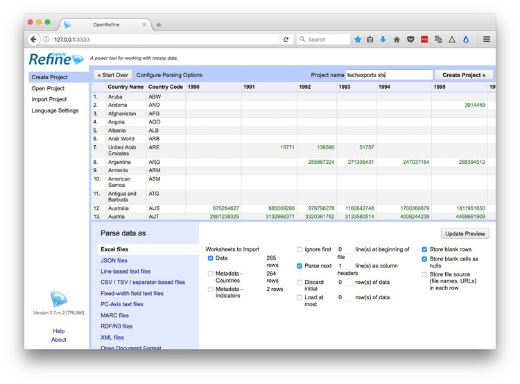
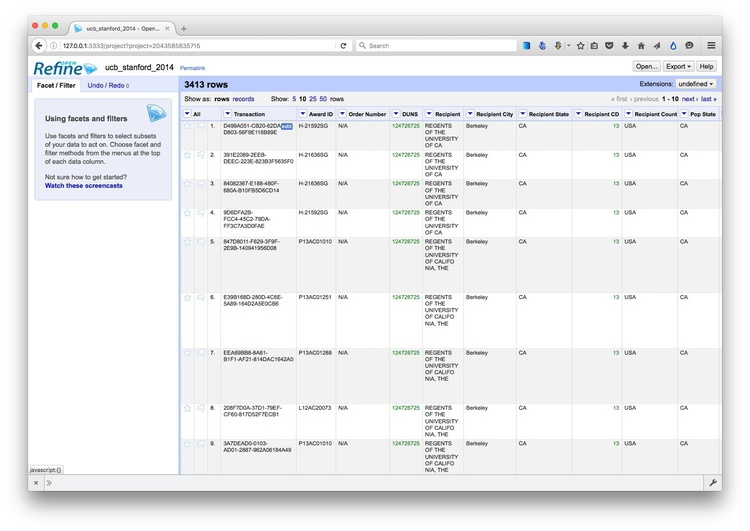

# Acquiring, cleaning, and formatting data

Not so many years ago, data was hard to obtain. Often journalists would have to painstakingly compile their own datasets from paper records. The Internet has changed the game. Today, many government and other public databases can now be queried online, and the results of those searches downloaded. Other datasets can be downloaded in their entirety.

The main problem today is usually not finding relevant data, but in working out whether it can be trusted, spotting and correcting errors and inconsistencies, and getting it in the right format for analysis and visualization.

In this class, we will cover some tips and tricks for finding the data you need online, and getting it onto your computer. We will consider how to recognize and clean “dirty” data, and review some common data formats, and learn how to convert from one to another.

### The data we will use

Download the data for this class from [here](data/week4.zip), unzip the folder and place it on your desktop. It contains the following files:

- `techexports.xls` [High-technology exports](http://data.worldbank.org/indicator/TX.VAL.TECH.CD) from 1990 to 2015, in current US dollars, from the UN Comtrade database, supplied via the World Bank. High-technology exports include products in aerospace, computers, pharmaceuticals, scientific instruments, and electrical machinery.

- `ucb_stanford_2014.csv` Data on federal government grants to UC Berkeley and Stanford University in 2014, downloaded from [USASpending.gov](https://www.usaspending.gov/Pages/Default.aspx).

- `alerts-actions_2017.xls` Records of [disciplinary alerts issued and actions taken](http://www.mbc.ca.gov/Publications/Disciplinary_Actions/) by the Medical Board of California in 2017.


Not so many years ago, data was hard to obtain. Often journalists would have to painstakingly compile their own datasets from paper records. The Internet has changed the game. Today, many government and other public databases can now be queried online, and the results of those searches downloaded. Other datasets can be downloaded in their entirety.

The main problem today is usually not finding relevant data, but in working out whether it can be trusted, spotting and correcting errors and inconsistencies, and getting it in the right format for analysis.

In this class, we will cover some tips and tricks for finding the data you need online, and getting it onto your computer. We will also review some common data formats, and learn how to convert from one to another.

### Understand common data formats

**[CSV](http://en.wikipedia.org/wiki/Comma-separated_values)** is just one variant of a "delimited" text file, in which the fields or columns in a table of data are separated by commas (hence comma-separated values, or CSV) or another character such as a tab. You may also encounter "fixed width" text files, in which the fields are lined up, with each located a specified number of characters across each row. Spreadsheets such as Libre Office Calc or Microsoft Excel can import fixed-width files, which you can then export in a delimited format for use in other software.

As we've already discussed, text files are great for transferring data from one software application to another during analysis and visualisation, but other formats that are easier for machines to read are typically used when transferring data between computers online.

**[JSON](http://json.org/)**, or JavaScript Object Notation, treats data as a series of “objects,” which begin and end with curly brackets. Each object in turn contains a series of name-value pairs. There is a colon between the name and value in each pair, and the pairs separated by commas.

Here, for example, are the first few rows of a simple dataset relating to a controversial theory claiming that the extent to which a country has developed a democratic political system is driven largely by the historical prevalence of infectious disease:

```json
[{"country":"Bahrain","income_group":"High income: non-OECD","democ_score":45.6,"infect_rate":23},
{"country":"Bahamas, The","income_group":"High income: non-OECD","democ_score":48.4,"infect_rate":24},
{"country":"Qatar","income_group":"High income: non-OECD","democ_score":50.4,"infect_rate":24},
{"country":"Latvia","income_group":"High income: non-OECD","democ_score":52.8,"infect_rate":25},
{"country":"Barbados","income_group":"High income: non-OECD","democ_score":46,"infect_rate":26}]
```

**[XML](http://www.w3.org/XML/)**, or Extensible Markup Language, is another format often used to move data around online. For example, the RSS feeds through which you can subscribe to content from blogs and websites using a reader such as [Feedly](https://feedly.com/) are formatted in XML.

In XML data is structured by enclosing values within “tags,” similar to those used to code different elements on a web page in HTML. Here is that same data in XML format:

```xml
<?xml version="1.0" encoding="UTF-8"?>
<rows>
  <row country="Bahrain" income_group="High income: non-OECD" democ_score="45.6" infect_rate="23" ></row>
  <row country="Bahamas, The" income_group="High income: non-OECD" democ_score="48.4" infect_rate="24" ></row>
  <row country="Qatar" income_group="High income: non-OECD" democ_score="50.4" infect_rate="24" ></row>
  <row country="Latvia" income_group="High income: non-OECD" democ_score="52.8" infect_rate="25" ></row>
  <row country="Barbados" income_group="High income: non-OECD" democ_score="46" infect_rate="26" ></row>
</rows>
```

### Data portals

Life is much easier if you can find everything you need in one place. The main effort to centralize access to data by the U.S. federal government is [Data.gov](http://www.data.gov/). You can search for data from the home page, or follow the [Data](http://catalog.data.gov/dataset) and Topics links from the top menu.

Be warned, however, that Data.gov is a work in progress, and does not contain all of the U.S. government’s data. Some of the most useful datasets are still only available on the websites of individual federal agencies. [FedStats](http://fedstats.sites.usa.gov/) has [links to agencies](http://fedstats.sites.usa.gov/agencies/) with data collections.

It is worth familiarizing yourself with the main government agencies that have responsibility for the beats you are interested in, and the datasets they maintain.


Other data portals at various levels of government are emerging. The City and County of San Francisco, for example, was at the forefront of the Open Data movement, establishing [DataSF](https://data.sfgov.org/) in 2009.

If you need to make comparisons between nations, the [**World Bank**](http://www.worldbank.org/) probably has what you need. Its [World Development Indicators catalog](http://data.worldbank.org/indicator/?tab=all) containing data for more than 7,000 different measures, compiled by the bank and other UN agencies.

You can navigate the site using the search box or using the topics links to the right. When you click on a particular indicator, you are sent to a page that gives options to download the dataset from a link near the top right of the page. The data in some cases goes back as far as 1960, and is listed both by individual country and summarized by regions and income groups.

Other useful sources of data for international comparisons are [**Gapminder**](http://www.gapminder.org/data/) and the **[UN Statistical Division](http://unstats.un.org/unsd/default.htm)**. For health data in particular, try the **[Organisation for Economic Co-operation and Development](http://www.oecd.org/els/health-systems/health-data.htm)** and the **[World Health Organization](http://www.who.int/gho/en/)**.

### Search for data on the web

Often, your starting point in searching for data and documents will be Google. It can be worth focusing your queries using Google’s [advanced search](http://www.google.com/advanced_search):


(Source: [Google](http://www.google.com/advanced_search))

The options to search by `site or domain` and `file type` can be especially useful when looking for data. For example, the [U.S. Geological Survey](http://www.usgs.gov/) is the best source of data on earthquakes and seismic risk, so when searching for this information, specifying the domain `usgs.gov` would be a good idea. You can make the domains as narrow or broad as you like: `.edu`, for instance, would search the sites of all US academic institutions using that top-level domain; `ucsc.edu` would search the web pages of this university only.

The file type search offers a drop-down menu, with the options including Excel spreadsheets, and Google Earth `KML` and `KMZ` files. These are common data formats, but you are not limited to those on the menu. In a regular Google search, type a space after your search terms followed by `filetype:xxx`, where `xxx` is the suffix for the file type in question. For example, `dbf` will look for database tables in this format. Combining file type and domain searches can be a good way to find data an agency has posted online -- some of which may not otherwise be readily accessible.

Searching for PDFs and `PPT` presentations can be a good way to find documents that may not otherwise be easy to find.

One common data format doesn’t show up file type searches. Geographical data is often made available as “shapefiles.” Because they consist of multiple files that are usually stored in compressed folders, shapefiles can’t readily be searched using a file type suffix, but they can usually be found by adding the terms “shapefile” or “GIS data” to a regular Google search.

### Search online databases

Many important public databases can be searched online, and some offer options to download the results of your queries. Most of these databases give a simple search box, but it’s always worth looking for the advanced search page, which will offer more options to customize your search. Here, for example, is the [advanced search](http://clinicaltrials.gov/ct2/search/advanced) page for [ClinicalTrials.gov](http://clinicaltrials.gov/):


(Source: [ClinicalTrials.gov](http://clinicaltrials.gov/ct2/search/advanced))

When you start working with a new online database, take some time to familiarize yourself with how its searches work: Read the Help or FAQs, and then run test searches to see what results you obtain. [Here](http://clinicaltrials.gov/ct2/help/how-find/index), for example, is the "How To" section of ClinicalTrials.gov.

Many online databases can be searched using Boolean logic, using the operators `AND`, `OR` and `NOT` to link search terms together. So find out how a particular database uses Boolean logic -- and the default settings that it will use if you list search terms without any Boolean operators.

Putting search terms in quote marks often searches for a specific phrase. For example, searching for “heart attack” on ClinicalTrials.gov will give only give results in which those two words appear together; leaving out the quote marks will include any trial in which both words appear.

Also find out whether the database allows “wildcards,” symbols such as `*` or `%` that can be dropped into your search to obtain results with variations on a word or number.

### Look for download options -- and know when you are hitting the wall

Having run a search on an online database, you will usually want to download the results, so look for the download links or buttons.

A common problem with online databases, however, is that they may impose limits on the number of results that are returned on each search. And even when a search returns everything, there may be a limit on how many of those results can be downloaded to your own computer.

If broad searches on a database keep returning the same number of results, that is a sign that you are probably running up against a search limit, and any download will not contain the complete set of data that you are interested in. However, you may be able to work out ways of searching to obtain all of the data in chunks.

### Download the entire database

Downloading an entire database, where this is allowed, frees you from the often-limited options given on an online advanced search form: You can then upload the data into your own database software, and query it in any way that you want. We will learn how to do this next week.

So always look for ways to grab all of the data. One trick is to run a search on just the database’s wildcard character, or with the query boxes left blank. If you do the latter at ClinicalTrials.gov, for instance, your search will return all of the trials in the database, which can then be downloaded using the options at the bottom of the results page.

Other databases have an online search form, but also have a separate link from where data to be downloaded in its entirety, usually as a text file or series of text files. One example is Bioresearch Monitoring Information System, which lists doctors and other researchers involved in testing experimental drugs being considered for marketing approval by the Food and Drug Administration. It can be searched online [here](http://www.accessdata.fda.gov/scripts/cder/BMIS/index.cfm?fuseaction=Search.ShowAdvancedSearchForm), but can also be downloaded in full from [here](http://www.fda.gov/Drugs/InformationOnDrugs/ucm135162.htm).

Note that large text files are again often stored in compressed folders, so may be invisible to a Google search by file type.

### Automate downloads of multiple data files

Often data or documents don't reside in a single searchable database, but instead exist online as a series of separate files. In such cases, clicking on each link is tedious and time-consuming. But you can automate the process using the [Batch Link Downloader](https://chrome.google.com/webstore/detail/batch-link-downloader/aiahkbnnpafepcgnhhecilboebmmolnn?hl=en-US) Chrome extension.

To illustrate, go to [Gapminder's data catalog](http://www.gapminder.org/data/), and select `All` indicators. The webpage now includes links to more than 500 downloadable spreadsheets.

Create a folder called `gapminder` on your desktop to hold the downloaded files.

Now temporaily change your download destination in Chrome so that the files are saved into this folder.

Select `Chrome>Preferences` from its top menu, then click the hamburger menu at top left:


Open up the `Advanced` menu and select `Downloads`, then change to the location to your `gapminder` folder.

The Batch Link Downloader downloads the target of any link on a web page. If it's a link to an image it will download an image; if it's a link to another webpage it will download that webpage; if it's a link to a data file such as a CSV file, it will download the file.

Now, back on the Gapminder data page, hover over some of the spreadsheet download icons, and see that the links all end with: `&Output=xlsx`. This is because they are the links to export Excel spreadhseets from the Google Sheets in which the data is stored.

Now click the Batch Link Downloaded icon:


Enter `xlsx` into the text box, click the `Add by filename pattern` button and all of the spreadsheets should be selected for download:


(If you were downloading CSV files, you would enter `.csv` into the text box, and so on.)

Click `Start download` and all the files should download into the target folder.

Once finished, make sure to switch you download location back, using Chrome Preferences as before!

### Extract data from tables on the web

On other occasions, data may exist in tables on the web. Copying and pasting data from web tables can be tricky, but the [Table Capture](https://chrome.google.com/webstore/detail/table-capture/iebpjdmgckacbodjpijphcplhebcmeop?hl=en) Chrome extension simplifies the process.

To illustrate what Table Captures does, go to [this table](https://www.nih.gov/about-nih/what-we-do/nih-almanac/appropriations-section-1) showing the budget history for components of the National Institutes of Health.

Click on the Table Capture icon:


Now you can click the `Copy to clipboard` link or `To Google Doc` to paste into a blank file (Excel spreadsheet or text file) or Google Sheet respectively. (If pasting into a text file, the delimeters between the columns with be tabs.)


This table is in two parts, so click on the `Section 2` link, and repeat the process to grab all the data.

### Manipulate urls to expose the data you need

As you search for data using web query forms, make a habit of looking at what happens to the url. Often it will contain patterns detailing the search you have run, and it will be possible to alter the data provided by manipulating the url. This can be quicker than filling in search forms. In some cases it may even reveal more data than default search options will allow.

To illustrate how this works, go to the [ISRCTN clinical tral registry](http://www.isrctn.com/), and then navigate to the [advanced search page](http://www.isrctn.com/editAdvancedSearch). Enter `cancer` under `Condition` and note that more than 2,000 trials are returned.

The url should now have changed to the following:

```Javascript
http://www.isrctn.com/search?q=&filters=condition%3Acancer&searchType=advanced-search
```
Notice that the default is to display 10 results per page, and then change the view to see the maximum of 100 trials allowed by the dropdown menu. The url should now read:

```Javascript
http://www.isrctn.com/search?pageSize=100&sort=&page=1&q=&filters=condition%3Acancer&searchType=advanced-search
```
Now change that url to:

```Javascript
http://www.isrctn.com/search?pageSize=2500&sort=&page=1&q=&filters=condition%3Acancer&searchType=advanced-search
```
Having done so, all of the registered clinical trials involving cancer should now be displayed on a single page. We could now use Batch Link Download to download all of the individual web pages describing each of these trials, or we could use this url as the starting point to scrape data from each of those pages.

### Use application programming interfaces (APIs)

Websites like the ISRCTN clinical trial registry are not expressly designed to be searched by manipulating their urls, but some organizations make their data available through APIs that can be queried by constructing a url in a similar way. This allows websites and apps to call in specific chunks of data as required, and work with it "on the fly."

To see how this works, go to the U.S. Geological Survey's [Search Earthquake Archives](http://earthquake.usgs.gov/earthquakes/search/) page, where we will search for all earthquakes with a [magnitude](http://www.geo.mtu.edu/UPSeis/magnitude.html) of 5 or greater that occured witin 6,000 kilometers of the geographic center of the contiguous United States, which [this site](http://tools.wmflabs.org/geohack/geohack.php?pagename=Geographic_center_of_the_contiguous_United_States&params=39.828175_N_98.579500_W_region:US_type:landmark) tells us lies at a latitude of `39.828175` degrees and a longitude of `-98.5795` degrees. We will initially ask for the data in a format called [GeoJSON](http://geojson.org/) (a variant of JSON, a common format used to trasmit data over the web). Enter `1960-01-01T00:00:00` under `Start` for `Date & Time` boxes so that we obtain all recorded earthquakes from the beginning of 1960 onward. The search form should look like this:


(Source: [U.S. Geological Survey](http://earthquake.usgs.gov/earthquakes/search/))

You should recieve a quantity of data at the following url:

```Javascript
http://earthquake.usgs.gov/fdsnws/event/1/query?starttime=1960-01-01T00:00:00&latitude=39.828175&longitude=-98.5795&maxradiuskm=6000&minmagnitude=5&format=geojson&orderby=time
```

See what happens if you append `-asc` to the end of that url: This should sort the the earthquakes from oldest to newest, rather than the default of newest to oldest. [Here](http://earthquake.usgs.gov/fdsnws/event/1/) is the full documentation for querying the earthquake API by manipulating these urls,

Now remove the `-asc` and replace `geojson` in the url with `csv`. The data should now download in 	CSV format.

### PDFs: The bane of data journalism

Some organizations persist in making data available as PDFs, rather than text files, spreadsheets or databases. This makes the data hard to extract. While you should always ask for data in a more friendly format -- ideally a CSV or other simple text file -- as a data journalist you are at some point likely to find yourself needing to pull data out of a PDF.

For digital PDFs, **[Tabula](http://tabula.technology/)** is a useful data extraction tool -- however it will not work with PDFs created by scanning the original document, which have to be interpreted using Optical Character Recognition (OCR) software.

Also useful is the online service **[Cometdocs](http://www.cometdocs.com/)**. While it is a commercial tool, members of Investigative Reporters and Editors can [obtain a free account](http://ire.org/blog/ire-news/2013/05/22/ire-announces-partnership-cometdocs/). Cometdocs can read scanned PDFs, however its accuracy will vary depending on how well the OCR works on the document in question.

**[Adobe Acrobat Pro](https://acrobat.adobe.com/us/en/products/acrobat-pro.html)** will also perform OCR on scanned PDFs.

[Here](https://github.com/jsfenfen/parsing-prickly-pdfs) is a useful set of resources detailing more advanced tools for dealing with hard-to-parse PDFs.

### Can I trust this data?

Having identified a possible source of data for your project, you need to ask: Is it reliable, accurate and useful? If you rush into analysis without considering this question, your hard work may be undermined by the maxim: “Garbage In, Garbage Out.”

The best rule of thumb in determining the reliability of a dataset is find out whether it has been used for analysis before, and if so, by whom. If a dataset was put together for an academic study, or is actively curated so it can be made available for experts to analyse, you can be reasonably confident that it is as complete and accurate as it can be -- the US Geological Survey's earthquake data is a good example.

While in general you might be more trusting of data downloaded from a `.gov` or `.edu` domain than something found elsewhere on the web, don’t simply assume that it is reliable and accurate. Before using any dataset, do some background research to find out how it was put together, and whether it has been rigorously checked for errors. If possible, try to speak to the people responsible for managing the database, and any academics or other analysts who have used the data. They will be your best guide to a dataset’s strengths and weaknesses.

Even for well-curated data, make a point of speaking with experts who compile it or use it, and ask them about the data's quirks and limitations. From talking with experts on hurricanes, for example, I know not to place too much trust in data on North Atlantic storms prior to about 1990, before satellite monitoring was well developed -- even though the [data available from the National Oceanic and Atmospheric Adminstration](http://www.aoml.noaa.gov/hrd/hurdat/Data_Storm.html) goes back to 1851.

Always ask probing questions of a dataset before putting your trust in it. Is this data complete? Is it up-to-date? If it comes from a survey, was it based on a representative sample of people who are relevant to your project? Remember that the first dataset you find online may not be the most relevant or reliable.

### Recognize dirty data

In an ideal world, every dataset we find would have been lovingly curated, allowing us to start analysing and visualising without worrying about its accuracy.

In practice, however, often the best available data has some flaws, which may need to be corrected as far as is possible. So before starting to work with a new dataset, look for common errors.

Look for glitches in the alignment of columns, which may cause data to appear in the wrong field.

For people’s names, look for variations in spelling, format, initials and accents, which may cause the same person to appear in multiple guises. Similar glitches may affect addresses, and any other information entered as text.

Some fields offer some obvious checks: if you see a zip code that contains anoything other than five or nine digits, for instance, you know it must be wrong.

Dates can also be entered incorrectly, so it’s worth scanning for those that fall outside the timeframe that should be covered by the data.

Also scan numbers for any obvious outliers. These values are worth checking out. Are they correct, or did someone misplace a decimal point or enter a number in the wrong units?

Other common problems are white spaces before and after some entries, which may need to be stripped out.

At all stages of your work, pay attention to zeros. Is each one actually supposed to represent zero, or should the cell in fact be empty? Take particular care exporting data from one software tool and importing to another, and check how empty cells, or "nulls," have been handled.

### Clean and process data with Open Refine

Checking and cleaning "dirty" data can be the most labor intensive part of  many data journalism projects, but **[Open Refine](http://openrefine.org/)** can streamline the task -- and also create a reproducible script to quickly repeat the process on data that must be cleaned and processed in the same way.

When you launch Open Refine, it opens in your web browser. However, any data you load into the program will remain on your computer -- it does not get posted online.

The opening screen should look like this:


#### Reshape data from wide to long format

Click the `Browse` button and navigate to the file `techexports.xls`. Click `Next>>`, and check that data looks correct:



Open Refine should recognize that the data is in a Excel spreadsheet file, but if not you can use the panel at bottom to specify the correct file type and format for the data. If your file has some initial header lines that need to be ignored, Open Refine can deal with that, too.

Numbers and dates should appear in green, plain text in black. Also change the `Project name` to remove the `xls`.

When you are satisfied that the data has been read correctly, click the `Create Project >>` button at top right. The screen should now look like this:


As you can see, the data is in wide format, with values for technology exports by country organized in columns, one for each year. To convert this to long format, click on the small downward-pointing triangle for the first of these year columns, and select `Transpose>Transpose cells across columns into rows`.

Fill in the dialog box as below, making sure that `From Column` and `To Column` are highlighted correctly, that the `Key column` and `Value column` have been given appropriate names, and that `Fill down in other columns` is checked. (Failing to do check this box will mean that the region names each will only appear once in the reshaped data, rather than being copied down to appear next to the corresponding data for year and oil production.)


Click `Transpose` and then the `50` rows link, to see the first 50 rows of the reshaped data:


Click the `Export` button at top right and you will see options to export the data in a variety of file types, including `Comma-separated value` and `Excel` spreadsheet.

#### Clean dirty data

Click the Open Refine logo at top left to return to the opening screen. Create a new project from the file `ucb_stanford_2014.csv`.

When importing a CSV or other text file, check that the correct column separator has been recognized, and also make sure to check `Parse cell text into numbers, dates ...`, otherwise every column will be imported as plain text:


Once imported, the project should look like this:



Again, each field/column has a button with a downward-pointing triangle. Click on these buttons and you get the option to create “facets” for the column, which provide a powerful way to edit and clean data.

Click on the button for the field `Recipent City`, and select `Facet>Text facet`. A summary of the various entries now appears in the panel to the left:


The numbers next to each entry show how many records there are for each value.

We can edit entries individually: Select `Veterans Bureau Hospi`, which is clearly not a city, click on the `Edit` link, change it to `Unknown`. (If cleaning this data for a real project, we would need to check with an external source to get the actual city for this entry.)

Another problem is that we have a mixture of cases, with some entries in Title or Proper Case, some in UPPERCASE. We can fix this back in the field itself. Click its button again and select `Edit cells>common transforms>To titlecase`.

Now notice that we apparently have duplicate entries for `Berkeley`, `Palo Alto` and `Stanford`. This is the result of trailing white space after the city names for some entries. Select `Edit cells>common transforms>Trim leading and trailing whitespace` and notice how the problem resolves:


Having cleaned this field, close the facet by clicking the cross at top left.

Now create a text facet for the field `Recipient`:


What a mess! The only possibilities are Stanford or Berkeley, yet there are multiple variants of each, many including `Board of Trustees` for Stanford and `Regents of` for UC Berkeley.

First, manually edit `Interuniveristy Center for Japanese Language` to `Stanford`, which is where this center is based.

We could continute editing manually, but to illustrate Open Refine's editing functions click on the `Cluster` button. Here you can experiment with different clustering algorithms to edit entries that may be variants of the same thing. Select `key collision` and `metaphone3`, then start checking the clusters and renaming them as `Berkeley` or `Stanford` as appropriate:


Click `Merge Selected & Close` and the facet can then be quickly edited manually:


Often we may need to convert fields to text, numbers or dates. For example, click on the button for `Award Date` and select `Edit cells>common transforms>To date` and see that it changes from a string of text to a date in standard format.

Notice the field `Award amount`, which is a value in dollars. Negative values are given in brackets. Because of these symbols, the field is being
recognized as a string of text, rather than a number. So to fix this problem, we have to remove the symbols.

Select `Edit colum>Add column based on this column...` and fill in the dialog box as follows:


This is the expression:

```JavaScript
value.replace('$','').replace(',','').replace('(','-').replace(')','')
```

Here `value` refers to the value in the original column, and `replace` is a function that replaces characters in the value. We can run several `replace` operations by "chaining" them together.

In this expression we are replacing the `$` symbols, the commas separating thousands, and the closing brackets with nothing; we are replacing the opening brackets with a hyphen to designate negative numbers.

Click `OK` and the new column will be created. Note that it is still being treated as text, but that can be corrected by selecting `Edit cells>common transforms>To number`.

This is just one example of many data transformation functions that can be accessed using Open Refine's expression language, called GREL. Learning these functions can make Open Refine into a very powerful data processing tool. Study the "Further reading" links for more.

Open Refine's facets can also be used to inspect columns containing numbers. Select `Facet>Numeric facet` for the new field. This will create a histogram showing the distribution of numbers in the field:


We can then use the slider controls to filter the data, which is good for examining possible outliers at the top of bottom of the range. Notice that here a small number of grants have negative values, while there is one grant with a value of more than $3 billion from the National Science Foundation. This might need to be checked out to ensure that it is not an error.

While most of the data processing we have explored could also be done in a spreadsheet, the big advantage of Open Refine is that we can extract a "pipeline" for processing data to use when we obtain data in the same format in future.

Select `Undo / Redo` at top left. Notice that clicking on one of the steps detailed at left will transform the data back to that stage in our processing. This means you don't need to worry about making mistakes, as it's always possible to revert to an earlier state, before the error, and pick up from there.

Return to the final step, then click the `Extract` button. At the dialog box, check only those operations that you will want to perform in future (typically generic transformations on fields/columns, and not correcting errors for individual entries). Here I have unchecked all of the corrections in the text facets, and selected just those operations that I know I will want to repeat if I obtain data from this source again:


This will generate JSON in the right hand panel that can be copied into a blank text file and saved.

To process similar data in future. Click the `Apply` button on the `Undo / Redo` tab, paste in the text from this file, and click `Perform Operations`. The data will then be processed automatically.

When you are finished cleaning and processing your data, click the `Export` button at top right to export as a CSV file or in other formats.

Open Refine is a very powerful tool that will reward efforts to explore its wide range of its functions for manipulating data, and to learn its expression language. See the Further Reading for more.


### Convert from one data format to another

**[Mr Data Converter](https://shancarter.github.io/mr-data-converter/)** is a web app made by Shan Carter, formerly of the graphics team at *The New York Times*, now with Google, that makes it easy to convert data from a spreadsheet or delimited text file to JSON or XML.

Copy the data from a `CSV` or tab-delimited text file and paste it into the top box, select the output you want, and it will appear at the bottom. You will generally want to select the `Properties` variants of JSON or XML.

You can then copy and paste this output into a text editor, and save the file with the appropriate suffix (`xml`, `json`).


(Source: [Mr Data Converter](https://shancarter.github.io/mr-data-converter/))

To convert data from JSON or XML into text files, use Open Refine. First create a new project and import your JSON or XML file. Then use the `Export` button and select `Tab-separated value` or `Comma-separated value` to export as a text file.

### Excercise/assignment

 - Using Open Refine, process the Medical Board of California 2017 disciplinary data in the file `alerts-actions_2017.xls` in the following way:
  - Separate city and state into two columns.
  - Process the doctors' names into four columns for each of: last name; first name; other names; suffix (Jr., II etc, if present).
  - Make sure no text columns have leading or trailing white space.
  - Remove the space from the license numbers so that they have the format `G34377`, `A92917`, and so on.
  - Remove the multiple header rows through the data
  - Rename all columns so that there are no spaces in the column names.
  - Fix any other problems you may find in the data.
  - Export the processed data as a CSV file.
  - Extract the JSON that would allow your data processing pipeline to be repeated on another of the downloads from [this page](http://www.mbc.ca.gov/Publications/Disciplinary_Actions/). Save the extracted JSON in a text file with the extension `.json`.
  - File your CSV and JSON files via bCourses.

**Deadline: Weds Feb 14 at 8pm**

### Further reading/resources

Paul Bradshaw. *[Scraping For Journalists](https://leanpub.com/scrapingforjournalists)*

[Open Refine Wiki](https://github.com/OpenRefine/OpenRefine/wiki)

[Open Refine Documentation](https://github.com/OpenRefine/OpenRefine/wiki/Documentation-For-Users)

[Open Refine Recipes](https://github.com/OpenRefine/OpenRefine/wiki/Recipes)


