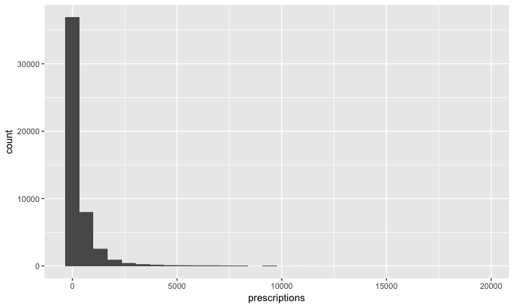
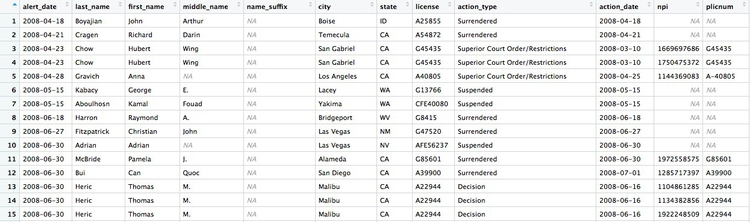
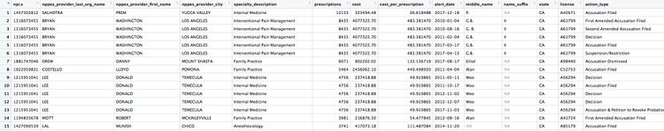

# Data journalism in the tidyverse

In last week's class we worked with a relatively small and simple dataset, on disciplinary actions against California doctors, to learn how to **filter**, **sort**, **group**, and **summarize** data.

Today we will work with the larger data on doctors in California prescribing opioids under Medicare Part D, learn how to **join** data in different data frames, and see how to make some simple charts to help make sense of your data.

First we will recap filtering, sorting, grouping and summarizing with the opioid prescription data.

### The data we will use

As for last week, [here](data/week5.zip). It contains the following files:

- `ca_discipline.csv` Disciplinary alerts and actions issued by the Medical Board of California from 2008 to 2017. Processed from downloads available [here](http://www.mbc.ca.gov/Publications/Disciplinary_Actions/). Contains the following variables:

	- `alert_date` Date alert issued.
	- `last_name` Last name of doctor/health care provider.
	- `first_name` First name of doctor/health care provider.
	- `middle_name` Middle/other names.
	- `name_suffix` Name suffix (Jr., II etc)
	- `city` City of practive location.
	- `state` State of practice location.
	- `license` California medical license number.
	- `action_type` Type of action.
	- `action_date` Date of action.


- `ca_medicare_opioids.csv` Data on prescriptions of opioid drugs under the Medicare Part D Prescription Drug Program by doctors in California, from 2013 to 2015. Filtered from the national data downloads available [here](https://www.cms.gov/Research-Statistics-Data-and-Systems/Statistics-Trends-and-Reports/Medicare-Provider-Charge-Data/Part-D-Prescriber.html). This is the public release of the data that ProPublica used FOIA to obtain for earlier years for the story we discussed in Week 2. Contains the following variables:
  - `npi` [National Provider Identifier](https://npiregistry.cms.hhs.gov/) (NPI) for the doctor/organization making the claim. This is a unique code for each health care provider.
  - `nppes_provider_last_org_name` For individual doctors, their last name. For organizations, the organziation name.
  - `nppes_provider_first_name` First name for indivisual doctors, blank for organizations.
  - `nppes_provider_city` City where the provider is located.
  - `nppes_provider_state` State where the provider is located; "CA" for all of these records.
  - `specialty_description` Provider's medical speciality, reported on their medicare claims. For providers that have more than one Medicare specialty code reported on their claims, the code associated with the largest number of services.
  - `description_flag` Source of the `specialty_description`. 
    - `S` Medicare Specialty Code description.
    - `T` Taxonomy Code Classification description.
  - `drug_name` Includes both brand names (drugs that have a trademarked name) and generic names (drugs that do not have a trademarked name).
  - `generic_name` The chemical ingredient of a drug rather than the trademarked brand name under which the drug is sold.
  - `bene_count` Total number of unique Medicare Part D beneficiaries (i.e. patients) with at least one claim for the drug. Counts fewer than 11 are suppressed and are indicated by a blank.
  - `total_claim_count` Number of Medicare Part D claims; includes original prescriptions and refills. If less than 11, counts are not included in the data file.
  - `total_30_day_fill_count` Total number of Medicare Part D standardized 30-day fills. The standardized 30-day fill is derived from the number of days supplied on each Part D claim divided by 30.
  - `total_day_supply` Total number of days' supply for this drug.
  -  `total_drug_cost` Total cost paid for all associated claims; includes ingredient cost, dispensing fee, sales tax, and any applicable fees.
  - `bene_count_ge65` Total number of unique Medicare Part D beneficiaries age 65 and older with at least one claim for the drug. A blank indicates the value is suppressed.
  - `bene_count_ge65_suppress_flag` Why the `bene_count_ge65` variable is suppressed:
    - `*` Suppressed due to `bene_count_ge65` between 1 and 10.
    - `#` Suppressed because the “less than 65 year old” group (not displayed) contains a beneficiary count between 1 and 10.
   - `total_claim_count_ge65` Number of Medicare Part D claims for beneficiaries age 65 and older; includes original prescriptions and refills. A blank indicates the value is suppressed.
   - `ge65_suppress_flag` Why the  `total_claim_count_ge65`, `total_30_day_fill_count ge65`, `total_day_supply_ge65`, and `total_drug_cost_ge65 variables` are suppressed:
 	- `*` Suppressed due to `total_claim_count_ge65` between 1 and 10.
	- `#` Suppressed because the “less than 65 year old” group (not displayed)
contains a claim count between 1 and 1.
  - `total_30_day_fill_count_ge65` Number of Medicare Part D standardized 30-day fills for beneficiaries age 65 and older. If `total_claim_count_ge65` is suppressed, this variable is also suppressed.
  - `total_day_supply_ge65` Total days' supply for which this drug was dispensed, for beneficiaries age 65 and older. If `total_claim_count_ge65` is suppressed, this variable is also suppressed.
  - `total_drug_cost_ge65` Total drug cost paid for all associated claims for beneficiaries age 65 and older. If `total_claim_count_ge65` is suppressed, this is also suppressed.
  - `year` 2013, 2014, or 2015.

- `npi_license.csv` Crosswalk file to join NPI identifiers to state license numbers, processed from the download available [here](http://www.nber.org/data/npi-state-license-crosswalk.html) to include license numbers potentially matching California doctors. This will provide one way of joining the precription data to the medical board disciplinary data. As we shall see, problems with the data mean that it is not infallible. Contains the following variables:
 - `npi` National Provider Identifier, as described above.
 - `plicnum` State license number, from the original file.
 - `license` Processed from `pclicnum` to conform to the format of California medical license numbers.

### Setting up

Open a new R script, save it into the folder with the data as `week6.R` then set your working directory to the location of this file, as we did last week. Then save your environment as `week6.Rdata`.

Also load the packages we will work with today:

```R
# load packages to read, write and process data, and to work with dates
library(readr)
library(dplyr)
library(ggplot2)
library(scales)
```
We worked with **readr** and **dplyr** last week. **[ggplot2](http://ggplot2.tidyverse.org/)** is a package for making charts that is also part of the tidyverse; **[scales](https://cran.r-project.org/web/packages/scales/scales.pdf)** is a package that allows numbers to displayed in formats including currency in dollars, with commas separating thousands, and so on.

### Work with the opioid prescriptions data

Load and view the data:

```R
# load opioid prescription data
ca_opioids <- read_csv("ca_medicare_opioids.csv")

# look at the data
View(ca_opioids)
```

#### Which doctors wrote the most prescriptions for fentanyl in 2015?

Fentanyl is a particularly controversial opioid, because of its strength: It's about [75 times more powerful](https://en.wikipedia.org/wiki/Fentanyl) than morphine. That means it can [easily cause fatal overdoses](https://www.buzzfeed.com/danvergano/fentanyl-leading-overdoses) -- although these mostly happen from illegaly purchased fentanyl.

From the final part of the assignment from last week, you should have seen that there are three variants of fentanyl in the `generic_name` data: `FENTANYL`, `FENTANYL CITRATE` and `FENTANYL CITRATE/PF`. So if we are to answer this question, we need to filter the data to include all of these drugs, and then add up the prescriptions for each doctor.

This is one way to do this:

```r
# who wrote the most prescriptions for fentanyl in 2015?
fentanyl_2015 <- ca_opioids %>%
  filter(year == 2015
         & (generic_name == "FENTANYL" | generic_name == "FENTANYL CITRATE" | generic_name == "FENTANYL CITRATE/PF")) %>%
  group_by(npi,
         nppes_provider_last_org_name,
         nppes_provider_first_name,
         nppes_provider_city,
         specialty_description) %>%
  summarize(prescriptions = sum(total_claim_count)) %>%
  arrange(desc(prescriptions))
```

There should be 5259 rows in the data, and the first few should look like this:


The logic of this code should be starting to become familiar. Notice how the `OR` part of the filter, using `|`, is put into parentheses to run it first.

After the filter, we need to group by doctor, before summarizing the data. The unique identifying code for each healthcare provider is their National Provider Identifier, or `npi`. However, if we only group by this, the data returned won't include any other information about each doctor. So the code above also groups by doctors' names, locations, and specialties, so the data returned contains more information. This won't change the grouping, because we are still grouping by individual healthcare provider.

In the `summarize` function, we need to add the numbers for `total_claim_count` for each provider, using the function `sum`, to get the total number of prescriptions written by each one for all the variants of fentanyl.

Here is another, more concise way to obtain the same result:

```r
# who wrote the most prescriptions for fentanyl in 2015?
fentanyl_2015 <- ca_opioids %>%
  filter(year == 2015
         & grepl("fentanyl", generic_name, ignore.case = TRUE)) %>%
  group_by(npi,
           nppes_provider_last_org_name,
           nppes_provider_first_name,
           nppes_provider_city,
           specialty_description) %>%
  summarize(prescriptions = sum(total_claim_count)) %>%
  arrange(desc(prescriptions))
```

This demonstrates some simple pattern matching on text, using the function `grepl("pattern_a|pattern_b", x)`, which searches variable `x` for values containing any of a list of text values. Including `ignore.case = TRUE` means that matches are made irrespective of the case of any of the letters.

`grepl` is useful for fuzzy text matching, when you want to find text entries that contain variations of the same word or phrase.

But notice that some of the top prescribers were not doctors, but physician assistants, nurse practitioners, or pharmacists. The following code also **filters** the data to remove data for these healthcare providers:

```r
# which doctors wrote the most prescriptions for fentanyl in 2015?
fentanyl_2015_doctors <- ca_opioids %>%
  filter(year == 2015
         & grepl("fentanyl", generic_name, ignore.case = TRUE)
         & !grepl("assistant|practitioner|pharmacist", specialty_description, ignore.case = TRUE)) %>%
  group_by(npi,
           nppes_provider_last_org_name,
           nppes_provider_first_name,
           nppes_provider_city,
           specialty_description) %>%
  summarize(prescriptions = sum(total_claim_count)) %>%
  arrange(desc(prescriptions))
```
The new part of the **filter** function uses `!grepl` to search for text that does *not* match the pattern, and separates patterns to be searched with `|` for `OR`.

There whould be 4,600 rows in this data, and the first few rows should look like this:


#### Calculate the total number of fentanyl prescriptions, their cost, and the total number of patients, for each year

```R
# calculate the total number of fentanyl prescriptions, their cost, and the total number of patient/drug, for each year
fentanyl_year_summary <- ca_opioids %>%
  filter(grepl("fentanyl", generic_name, ignore.case = TRUE)) %>%
  group_by(year) %>%
  summarize(claims = sum(total_claim_count),
            cost = sum(total_drug_cost),
            patients = sum(bene_count))
```

This will be the result:


Something has gone wrong: Instead of calculating the number of patients, the code has returned `NA`. This will happen when **summarizing** data if there are any missing, or `NA`, values. To solve the problem, use the following code, which includes `na.rm = TRUE`. This tells summary functions to remove `NA` values before running the calculation:

```R
# calculate the total number of fentanyl prescriptions, their cost, and the total number of patient/drug, for each year
fentanyl_year_summary <- ca_opioids %>%
  filter(grepl("fentanyl", generic_name, ignore.case = TRUE)) %>%
  group_by(year) %>%
  summarize(claims = sum(total_claim_count),
            cost = sum(total_drug_cost),
            patients = sum(bene_count, na.rm = TRUE))
```


Now we have data showing a number of patients prescribed fentanyl each year. However, we should treat this number with caution. The description of the data above explains that `NA` values are introduced wherever a doctor prescribed fentanyl to fewer than 11 patients. So each `NA` represents between 1 and 10 patients.

How many patients could be missing from the data each year?

```R
# how many patients might be missing from the data?
fentanyl_year_missing <- ca_opioids %>%
  filter(grepl("fentanyl", generic_name, ignore.case = TRUE)
         & is.na(bene_count)) %>%
  group_by(year) %>%
  summarize(max_missing_patients = n()*10)
```
This should be the result:


That's a lot of potentially missing patients -- more than we added up from the available data. We should abandon the idea of analyzing the number of patients.

In this code we used `is.na(bene_count)` to **filter** for only the missing values, then **grouped** by year, **summarized** by counting the number of records and multiplied by 10, because each missing value could represent up to 10 patients.


#### Create a summary, showing the number of opioid prescriptions written by each doctor, the total cost of the opioids prescribed, and the cost per claim

```R
# Create a summary, showing the number of opioid prescriptions written by each doctor, the total cost of the opioids prescribed, and the cost per claim
doctor_summary <- ca_opioids %>%
  filter(!grepl("assistant|nurse|pharmacist", specialty_description, ignore.case = TRUE)) %>%
  group_by(npi,
           nppes_provider_last_org_name,
           nppes_provider_first_name,
           nppes_provider_city,
           specialty_description) %>%
  summarize(prescriptions = sum(total_claim_count),
            cost = sum(total_drug_cost)) %>%
  mutate(cost_per_prescription = cost/prescriptions) %>%
  arrange(desc(prescriptions))
```
In this code, the **filter** removes the physician assistants, nurse practitioners, and pharmacists. Then we **group** by doctor, returning the same identifying information as in earlier examples, before **summarizing** by adding the number of prescriptions written, and the total cost of the drugs, across the entire three-year time period in the data. Then we use `mutate` to create a new column giving the cost per prescription for each doctor. Finally we **sort** in descending order of the total number of prescriptions written.

There should be 49,277 rows in the data, and the top few should look like this:


### Draw some charts from this summary data

While running data analyses, it's often useful to create charts to look at summaries of the data. Particularly useful are histograms, to examine a distribution, and scatterplots, to see how one variable varies with another.

To make simple charts, we will use **ggplot2**.

#### Introducing ggplot2 and the grammar of graphics

The "gg" in **ggplot2** stands for "[grammar of graphics](http://www.amazon.com/The-Grammar-Graphics-Statistics-Computing/dp/0387245448)," an approach to drawing charts devised by the statistician Leland Wilkinson. Rather than thinking in terms of finished charts like a scatter plot or a column chart, it starts by defining the coordinate system (usually the X and Y axes), maps data onto those coordinates, and then adds layers such as points, bars and so on. This is the logic behind ggplot2 code.

Some key things to understand about **ggplot2**:

- `ggplot` This is the master function that creates a **ggplot2** chart.
- `aes` This function, named for "aesthetic mapping," is used whenever data values are mapped onto a chart. So it is used when you define which variables are plotted onto the X and Y axes, and also if you want to change the size or color of parts of the chart according to values for a variable.
- `geom` All of the functions that add layers to a chart start with `geom`, followed by an underscore, for example `geom_point` or `geom_bar`. The code in the parentheses for any `geom` layer styles the items in that layer, and can include `aes` mappings of values from data.
- `theme` This function modifies the appearance of elements of a plot, used, for example, to set size and font face for text, the position of a legend, and so on.
- `scale` Functions that begin with `scale`, followed by an underscore, are used to modify the way an `aes` mapping of data appears on a chart. They can change the axis range, for example, or specify a color palette to be used to encode values in the data.
- `+` is used each time you add a layer, a scale, a theme, or elements like axis labels and a title. After a `+` you can continue on the same line of code or move the next line. I usually write a new line after each `+`, which makes the code easier to follow.

#### Make a histogram of the prescriptions data

```R
# histogram of the costs data
ggplot(doctor_summary, aes(x = prescriptions)) +
  geom_histogram()
```
This code first noted that the `doctor_summary` data would be used for the chart in the `ggplot` function, then specificies that values for the number of prescriptions should be mapped to the X, or horizontal axis. We didn't need to specify a variable for the Y axis for a histogram, because that is automatically a count of the number of records (here the number of doctors) in each bin.

This should be the result:



The following code customizes the width of the bins, to 50 prescriptions, changes the X axis range between 0 and 3,000, and uses `labels` from the **scales** package to plot numbers with comma separators for thousands. `theme_minimal` is one of the built-in themes in **ggplot2**, which gives a basic chart with grid lines on a white background.

```R
ggplot(doctor_summary, aes(x = prescriptions)) +
  geom_histogram(binwidth = 50) +
  theme_minimal() +
  scale_x_continuous(limits = c(0,3000),
                     labels = comma) +
  scale_y_continuous(labels = comma)
```


This is a very skewed distribution. Viewing this, we would conclude that the mean would not be a good summary statistic for this data; if we want to compare any doctor's prescriptions of opioids to that for a "typical" doctor, it would be better to compare to the median number of prescriptions.

```R
# calculate the mean and median number of opioid prescriptions written by CA doctors from 2013 to 2015
mean_median <- doctor_summary %>%
  ungroup() %>%
  summarize(mean_prescriptions = mean(prescriptions),
            median_prescriptions = median(prescriptions))
```

This should be the result:


In the code above, we needed to `ungroup` before **summarizing**, otherwise the data would still be grouped by doctor.

#### Make a scatterplot of prescriptions and costs data

Scatterplots are good for seeing how one variable relates to one another, and also for spotting outliers in data. Here we would expect the total cost of the drugs prescribed to increase with the total number of prescriptions. A scatterplot allows us to see whether all the doctors are closely clustered around the trend line, or whether there are some interesting outliers.

```R
#### Make a scatterplot of prescriptions and costs data
ggplot(doctor_summary, aes(x = prescriptions, y = cost)) +
  geom_point(alpha = 0.3) +
  geom_smooth(method = lm) +
  theme_minimal() +
  scale_x_continuous(labels = comma) +
  scale_y_continuous(labels = dollar)
```
In this code, we mapped the number of `prescriptions` to the X axis and their total `cost` to the Y or vertical axis. We then used `geom_point` to add the points, and made them partially transparent using `alpha = 0.3` (0 would be completely transparent; 1 would be completely opaque). `geom_smooth` added a trend line through the data; `method = lm` ensured that this is fitted with a "linear model," giving a straight line. `labels = dollar` formatted the Y axis so the numbers were shown in dollars.

This should be the result:


We can look sort the data in `View` to take a look at the doctors with unusually large costs per prescriptions:


Remember the words of caution from the previous class: There may be some story leads here, but we would have to find out more about each doctor's practise and patients to determine whether their high costs per prescription are justified.

We have only scratched the surface of what is possible with **ggplot2**: Its capabilities are covered at length in **J221: Introduction to Data Visualization**.

See the links in Further Reading for reference on **ggplot2** code.

### Join data to find doctors who prescribed opioids who have also been subject to disciplinary actions.

There are a number of **join** functions in **dplyr** to combine data from two data frames. Here are the most useful:

- `inner_join()` returns values from both tables only where there is a match.
- `left_join()` returns all the values from the first-mentioned table, plus those from the second table that match.
- `semi_join()` filters the first-mentioned table to include only values that have matches in the second table.
- `anti_join()` filters the first-mentioned table to include only values that have no matches in the second table.

[Here is a useful reference](http://stat545-ubc.github.io/bit001_dplyr-cheatsheet.html) for managing joins with **dplyr**.

We will join the `doctor_summary` data to the disciplinary action data to see which of the doctors prescribing opioids have been in trouble with the Medical Board of California. The unique identifier in the prescriber data is their National Provider Identifier, whereas the unique identifier in the disciplinary data are the doctors' California medical license numbers. So we also need to load the file `npi_license.csv`, which relates these two identifiers to one another.

```R
# load data
ca_discipline <- read_csv("ca_discipline.csv")

npi_license <- read_csv("npi_license.csv")
```

First we will join these two files to one another:

```R
# join those two data frames
ca_discipline_npi <- left_join(ca_discipline, npi_license)
```

By default, **dplyr** will join by any variables with matching names, but you can also specify the variables on which to join. So this will achieve the same result:

```R
# join those two data frames
ca_discipline_npi <- left_join(ca_discipline, npi_license, by = "license")
```


If we `View` the result, the first few rows reveal some of the limitations of the `npi_license` data. Some of the doctors have not been joined to an `npi` code, while others appear to have more than one `npi` code (this is why there are 9,680 rows in the joined data, and only 7,651 in the `ca_discipline` data).



Having made this join, we can now join to the `doctors_summary` data:

```R
# join disciplinary action data to the opioid prescription data
doctor_summary_actions <- inner_join(doctor_summary, ca_discipline_npi, by = "npi") %>%
  arrange(desc(prescriptions))
```

Here are the first few rows in the data:


Individual doctors may appear multiple times in the data if they have more than one disciplinary action on their file, because a join will be made to each individual action.

We can search for the disciplinary records and look at public documents at [this site](https://www.breeze.ca.gov/).

The second doctor on our list, Naga Thota, surrendered his California medical license on March 22, 2017. [This public document](http://www2.mbc.ca.gov/BreezePDL/document.aspx?path=%5cDIDOCS%5c20170315%5cDMRAAAFC8%5c&did=AAAFC170315180454982.DID) reveals that he was charged with prescribing excessive quantities of opioids to an addicted patient with whom he also engaged in a sexual relationship. In addition to disciplinary action from the Medical Board of California, he faced a criminal investigation by the federal Drug Enforcement Adminstration. In March 2017 [sentenced to two years](http://www.sandiegouniontribune.com/news/courts/sd-me-thota-sentencing-20170306-story.html), he was sentenced to two years in a federal prison.

The prescriptions data reveal that, prior to his convection and the loss of his medical license, Thota was also one of the largest prescribers of opioids in the state of California.

There are likely to be other story leads from this join, which you could follow up through public records and other reporting.

We've already seen that the `npi_license` data has some limitations. Another (less reliable) way to join the data would be by using the doctors' first names, last names, and cities. First, however, we need to convert those variables in the `ca_discipline_npi` data to upper case, so they match the format of the `ca_opioids` data.

```R
# change case of variables to be used in the join
ca_discipline_npi <- ca_discipline_npi %>%
  mutate(last_name = toupper(last_name),
         first_name = toupper(first_name),
         city = toupper(city))

# join disciplinary action data to the opioid prescription data
doctor_summary_actions_2 <- inner_join(doctor_summary, ca_discipline_npi, by = c("nppes_provider_last_org_name" = "last_name", 
                                                                                 "nppes_provider_first_name" = "first_name",
                                                                                 "nppes_provider_city" = "city")) %>%
  arrange(desc(prescriptions))
```

Notice how the code is written to define the variables to be used for a custom join.

Now we can use an `anti_join` to see if this join picked up any doctors who were missing from the first.

```R
# join disciplinary action data to the opioid prescription data
doctors_summary_actions_extra <- anti_join(doctor_summary_actions_2, doctor_summary_actions)
```

Here are the first few rows in that data:



Whenever making an join in this way, it crucial to verify through independent reporting that the individuals matched are the same person. For example, there are several doctors called Peter Lee in Los Angeles. The one with the disciplinary record is [Peter Geon Lee](https://search.dca.ca.gov/details/8002/G/84673/aebacf63f2746d6ce6ac729ebbbe54f5), a plastic surgeon. This is not [Peter Chong Lee](https://search.dca.ca.gov/details/8002/A/47846/e516806f7ff2db771d5b14b7d175c755), the physical medicine and rehabilitation specialist, with the NPI of `1063508786`, listed in the `ca_opioids` data. There may well be other false matches in the data.

### Further reading

**[Introduction to dplyr](https://cran.r-project.org/web/packages/dplyr/vignettes/dplyr.html)**

**[RStudio Data Wrangling Cheet Sheet](https://www.rstudio.com/wp-content/uploads/2015/02/data-wrangling-cheatsheet.pdf)**
Also introduces the [tidyr](https://blog.rstudio.org/2014/07/22/introducing-tidyr/) package, which can manage wide-to-long transformations, and text-to-columns splits, among other data manipulations.

[***R Graphics Cookbook***](http://www.amazon.com/R-Graphics-Cookbook-Winston-Chang/dp/1449316956) by Winston Chang
(Chang also has [a helpful website](http://www.cookbook-r.com/) with much of the same information, available for free.)

[**RStudio ggplot2 Cheat Sheet**](https://www.rstudio.com/wp-content/uploads/2015/08/ggplot2-cheatsheet.pdf)

[**ggplot2 documentation**](http://ggplot2.tidyverse.org/reference/)


**[Stack Overflow](http://stackoverflow.com/)**
For any work involving code, this question-and-answer site is a great resource for when you get stuck, to see how others have solved similar problems. Search the site, or [browse R questions](http://stackoverflow.com/questions/tagged/r)


