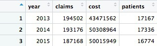

### Work with the opioid prescriptions data

First load and view the data:

```R
# load opioid prescription data
ca_opioids <- read_csv("ca_medicare_opioids.csv")

# look at the data
View(ca_opioids)
```

#### Which doctors wrote the most prescriptions for fentanyl in 2015?

One of the drugs in the `generic_name` variable is `FENTANYL`. Fentanyl is a particularly controversial drug, because of its strength -- it's about [75 times more powerful](https://en.wikipedia.org/wiki/Fentanyl) than morphine. That means it can [easily cause fatal overdoses](https://www.buzzfeed.com/danvergano/fentanyl-leading-overdoses).

So let's look at which providers wrote the most prescriptions for fentanyl in the most recent year in the data, 2015.

```r
# who wrote the most prescriptions for fentanyl in 2015?
fentanyl_2015 <- ca_opioids %>%
  filter(generic_name == "FENTANYL"
         & year == 2015) %>%
  arrange(desc(total_claim_count)) %>%
  select(npi,
         nppes_provider_last_org_name,
         nppes_provider_first_name,
         nppes_provider_city,
         specialty_description,
         total_claim_count)
```

The logic of this code should now be familiar. When working with a sprawling dataset like this, with many variables, it's a good idea to use `select` to return only those that you want to see. Here we have selected identifying information for each health care provider, and `total_claim_count`.

There should be 5,346 rows in the data, and the first 20 rows should look like this:


Notice that many of the top prescribers were not doctors, but physician assistants, nurse practitioners, or pharmacists. The following code also **filters** the data to remove data for these healthcare providers:

```r
# which doctors wrote the most prescriptions for fentanyl in 2015?
fentanyl_2015_doctors <- ca_opioids %>%
  filter(generic_name == "FENTANYL" 
         & year == 2015 
         & specialty_description != "Physician Assistant" 
         & specialty_description != "Nurse Practitioner"
         & specialty_description != "Pharmacist") %>%
  arrange(desc(total_claim_count)) %>%
  select(npi,
         nppes_provider_last_org_name,
         nppes_provider_first_name,
         nppes_provider_city,
         specialty_description,
         total_claim_count)
```

There whould be 4,673 rows in this data, and the first 20 rows should look like this:


If you run this code, you should obtain exactly the same result:

```r
# which doctors wrote the most prescriptions for fentanyl in 2015?
fentanyl_2015_doctors <- ca_opioids %>%
  filter(generic_name == "FENTANYL" 
         & year == 2015 
         & !grepl("assistant|practitioner|pharmacist", 
                  specialty_description, 
                  ignore.case = TRUE)) %>%
  arrange(desc(total_claim_count)) %>%
  select(npi,
         nppes_provider_last_org_name,
         nppes_provider_first_name,
         nppes_provider_city,
         specialty_description,
         total_claim_count)
```

This demonstrates some simple pattern matching on text, using the function `grepl("pattern_a|pattern_b", x)`, which searches variable `x` for values containing any of a list of text values. Including `ignore.case = TRUE` means that matches are made irrespective of the case of any of the letters.

As well as allowing you to write more succint code, as above, `grepl` is useful for fuzzy text matching, when you want to find text entries that contain variations of the same word. For example, entries containing `Russia`, `Russian` and `Russia's` in variable `x` would all be found by `grepl("Russia", x)`.

#### Calculate the total number of fentanyl prescriptions, their cost, and the total number of patients, for each year

```R
# calculate the total number of fentanyl prescriptions, their cost, and the total number of patient/drug , for each year
fentanyl_year_summary <- ca_opioids %>%
  filter(generic_name == "FENTANYL") %>%
  group_by(year) %>%
  summarize(claims = sum(total_claim_count),
            cost = sum(total_drug_cost),
            patients = sum(bene_count))
```

This code uses the `sum` function to **summarize** the data by adding the values for each year.

This will be the result:


Something has gone wrong: Instead of calculating the number of patients, the code has returned `NA`. This will happen when **summarizing** data if there are any missing, or `NA`, values. To solve the problem, use the following code, which includes `na.rm = TRUE`. This tells summary functions to remove `NA` values before running the calculation:

```R
# calculate the total number of fentanyl prescriptions, their cost, and the total number of patient/drug, for each year
fentanyl_year_summary <- ca_opioids %>%
  filter(generic_name == "FENTANYL") %>%
  group_by(year) %>%
  summarize(claims = sum(total_claim_count),
            cost = sum(total_drug_cost),
            patients = sum(bene_count, na.rm = TRUE))
```



Now we have data showing a number of patients prescribed fentanyl each year. However, we should treat this number with caution. The `NA` values are introduced wherever a doctor prescribed fentanyl to fewer than 11 patients. So each `NA` represents between 1 and 10 patients.

How many patients could that be each year?

```R
# how many patients might be missing from the data?
fentanyl_year_missing <- ca_opioids %>%
  filter(generic_name == "FENTANYL"
         & is.na(bene_count)) %>%
  group_by(year) %>%
  summarize(max_missing_patients = n()*10)
```
This should be the result:


That's a lot of potentially missing patients -- more than we added up form the available data. We should abandon the idea of analyzing the number of patients.

In this code we used `is.na(bene_count)` to **filter** for only the missing values, then **grouped** by year, **summarized** by counting the number of records and multiplied by 10, because each missing value could represent up to 10 patients.

