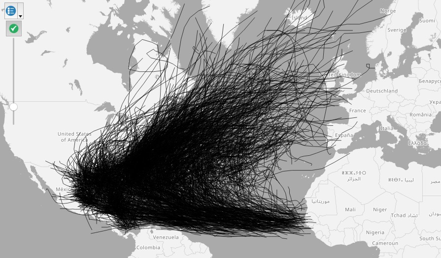

## North Atlantic storm data for PostGIS

This code loads a shapefile `storms` into a PostgreSQL database with PostGIS enabled. The shapefile was made in QGIS from the file `storms.csv`, which in turn was made by the parser `hurdat2_parser.py` from the National Oceanic and Atmospheric Adminstration data [here](http://www.aoml.noaa.gov/hrd/hurdat/hurdat2-1851-2016-apr2017.txt), downloaded as `HURDAT2.txt`. (Note, I also had to make a couple of manual corrections in the CSV file for longitude values given incorrectly in the NOAA as negative degrees W, rather than positive degrees E.)

```{r results="hide", warning=FALSE, message=FALSE}
# load required packages
library(rgdal)
library(RPostgreSQL)
library(rpostgis)
library(dplyr)
```

#### Load and process the data

``` {r, warning=FALSE, message=FALSE}
# load shapefile
storms <- readOGR("storms", "storms")

# quick plot to check it looks right
plot(storms)

# look at data in attribute table
glimpse(storms@data)

# change data types, remove abbreviated column names
storms@data <- storms@data %>%
  mutate(name = as.character(name),
         year = as.integer(as.character(year)),
         month = as.integer(as.character(month)),
         day = as.integer(as.character(day)),
         hour = as.integer(as.character(hour)),
         minute = as.integer(as.character(minute)),
         timestamp = as.POSIXct(timestamp),
         record_ident = as.character(record_ide),
         status = as.character(status),
         max_wind_knts = as.integer(as.character(max_wind_k)),
         max_wind_kph = as.integer(as.character(max_wind_1)),
         max_wind_mph = as.integer(as.character(max_wind_m)),
         min_press = as.integer(as.character(min_press))) %>%
  select(-max_wind_k, -max_wind_1, -max_wind_m, -record_ide)

# look at data in attribute table again
glimpse(storms@data)
```

#### Set up database connection and load the data into the DB

``` {r, warning=FALSE, message=FALSE}
# create DB and set up local connection
system("createdb storms")
drv <- dbDriver("PostgreSQL")
con <- dbConnect(drv, dbname = "storms", host = "localhost")

# load data into DB
pgInsert(con, name = "storms", data.obj = storms, geom = "geom", df.mode = FALSE,
         partial.match = FALSE, overwrite = TRUE, new.id = NULL,
         row.names = FALSE, upsert.using = NULL, alter.names = FALSE,
         encoding = NULL, return.pgi = FALSE)
```

#### Execute PostGIS SQL query to turn points into tracks for each storm 

```{sql connection=con}
CREATE TABLE storms_tracks AS
SELECT ST_Makeline(points.geom) AS geom,points.year,points.name
FROM (SELECT geom,year,name FROM storms ORDER BY year,name,timestamp) AS points
GROUP BY name,year
```

#### Here's what the data looks like loaded into QGIS from the DB


<br>


